# Akka.API.Tests

## Overview

| Property | Value |
|----------|-------|
| Category | Test |
| Repository | akka.net |
| Path | `src/core/Akka.API.Tests/Akka.API.Tests.csproj` |
| Project References | 15 |
| NuGet Dependencies | 6 |
| Consumers | 0 |

## Dependency Diagram

```mermaid
graph TD
    Akka_API_Tests["<strong>Akka.API.Tests</strong>"]
    Akka_Cluster_Metrics["Akka.Cluster.Metrics"]
    Akka_API_Tests --> Akka_Cluster_Metrics
    Akka_Cluster_Sharding["Akka.Cluster.Sharding"]
    Akka_API_Tests --> Akka_Cluster_Sharding
    Akka_DistributedData["Akka.DistributedData"]
    Akka_API_Tests --> Akka_DistributedData
    Akka_Persistence_Query_InMemory["Akka.Persistence.Query.InMemory"]
    Akka_API_Tests --> Akka_Persistence_Query_InMemory
    Akka_TestKit_Xunit2["Akka.TestKit.Xunit2"]
    Akka_API_Tests --> Akka_TestKit_Xunit2
    Akka_Coordination["Akka.Coordination"]
    Akka_API_Tests --> Akka_Coordination
    Akka_Discovery["Akka.Discovery"]
    Akka_API_Tests --> Akka_Discovery
    Akka_Persistence_Query["Akka.Persistence.Query"]
    Akka_API_Tests --> Akka_Persistence_Query
    Akka_TestKit["Akka.TestKit"]
    Akka_API_Tests --> Akka_TestKit
    Akka["Akka"]
    Akka_API_Tests --> Akka
    Akka_Cluster["Akka.Cluster"]
    Akka_API_Tests --> Akka_Cluster
    Akka_Cluster_Tools["Akka.Cluster.Tools"]
    Akka_API_Tests --> Akka_Cluster_Tools
    Akka_Persistence["Akka.Persistence"]
    Akka_API_Tests --> Akka_Persistence
    Akka_Remote["Akka.Remote"]
    Akka_API_Tests --> Akka_Remote
    Akka_Streams["Akka.Streams"]
    Akka_API_Tests --> Akka_Streams
```

## Project References
- Akka.Cluster.Metrics
- Akka.Cluster.Sharding
- Akka.DistributedData
- Akka.Persistence.Query.InMemory
- Akka.TestKit.Xunit2
- Akka.Coordination
- Akka.Discovery
- Akka.Persistence.Query
- Akka.TestKit
- Akka
- Akka.Cluster
- Akka.Cluster.Tools
- Akka.Persistence
- Akka.Remote
- Akka.Streams

## External NuGet Packages
| Package | Version |
|---------|---------||
| Microsoft.NET.Test.Sdk | 17.9.0 |
| xunit | 2.8.1 |
| xunit.runner.visualstudio | 2.8.1 |
| PublicApiGenerator | 11.5.0 |
| Verify.Xunit | 25.0.2 |
| Verify.DiffPlex | 3.0.0 |

---

*[Back to Index](../index.md)*
