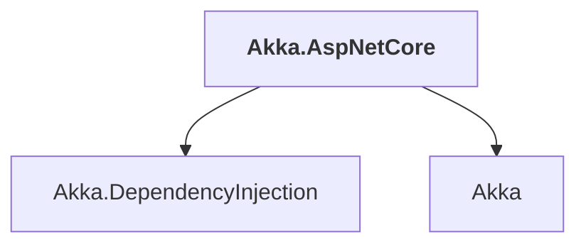

# Akka.AspNetCore

## Overview

| Property | Value |
|----------|-------|
| Category | WebApp |
| Repository | akka.net |
| Path | `src/examples/AspNetCore/Akka.AspNetCore/Akka.AspNetCore.csproj` |
| Project References | 2 |
| NuGet Dependencies | 1 |
| Consumers | 0 |

## Dependency Diagram

## Project References
- Akka.DependencyInjection
- Akka

## External NuGet Packages
| Package | Version |
|---------|---------||
| Swashbuckle.AspNetCore | 6.5.0 |

---

*[Back to Index](../index.md)*
