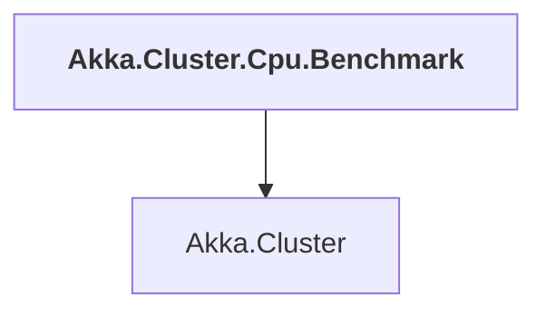

# Akka.Cluster.Cpu.Benchmark

## Overview

| Property | Value |
|----------|-------|
| Category | Application |
| Repository | akka.net |
| Path | `src/benchmark/Akka.Cluster.Cpu.Benchmark/Akka.Cluster.Cpu.Benchmark.csproj` |
| Project References | 1 |
| NuGet Dependencies | 3 |
| Consumers | 0 |

## Dependency Diagram

## Project References
- Akka.Cluster

## External NuGet Packages
| Package | Version |
|---------|---------||
| NDesk.Options.Core | 1.2.8 |
| Tmds.ExecFunction | 0.7.1 |
| Universe.CpuUsage | 2.2.497.598 |

---

*[Back to Index](../index.md)*
