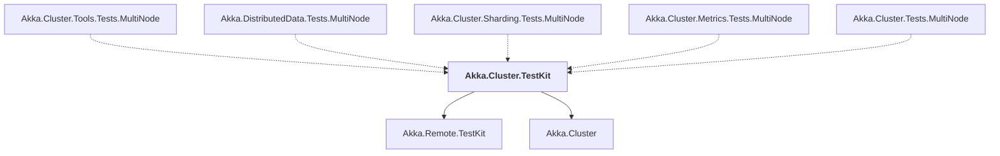

# Akka.Cluster.TestKit

## Overview

| Property | Value |
|----------|-------|
| Category | Test |
| Repository | akka.net |
| Path | `src/core/Akka.Cluster.TestKit/Akka.Cluster.TestKit.csproj` |
| Project References | 2 |
| NuGet Dependencies | 0 |
| Consumers | 5 |

## Dependency Diagram

## Project References
- Akka.Remote.TestKit
- Akka.Cluster

## Consumed By
- Akka.Cluster.Tools.Tests.MultiNode
- Akka.DistributedData.Tests.MultiNode
- Akka.Cluster.Sharding.Tests.MultiNode
- Akka.Cluster.Metrics.Tests.MultiNode
- Akka.Cluster.Tests.MultiNode

---

*[Back to Index](../index.md)*
