# Akka.Cluster.Tools

## Overview

| Property | Value |
|----------|-------|
| Category | Tool |
| Repository | akka.net |
| Path | `src/contrib/cluster/Akka.Cluster.Tools/Akka.Cluster.Tools.csproj` |
| Project References | 3 |
| NuGet Dependencies | 1 |
| Consumers | 13 |

## Dependency Diagram

```mermaid
graph TD
    Akka_Cluster_Tools["<strong>Akka.Cluster.Tools</strong>"]
    Akka_Cluster["Akka.Cluster"]
    Akka_Cluster_Tools --> Akka_Cluster
    Akka_Coordination["Akka.Coordination"]
    Akka_Cluster_Tools --> Akka_Coordination
    Akka_Discovery["Akka.Discovery"]
    Akka_Cluster_Tools --> Akka_Discovery
    Akka_Cluster_Tools_Tests_MultiNode["Akka.Cluster.Tools.Tests.MultiNode"]
    Akka_Cluster_Tools_Tests_MultiNode -.-> Akka_Cluster_Tools
    Akka_Cluster_Tools_Tests["Akka.Cluster.Tools.Tests"]
    Akka_Cluster_Tools_Tests -.-> Akka_Cluster_Tools
    Akka_Cluster_Sharding["Akka.Cluster.Sharding"]
    Akka_Cluster_Sharding -.-> Akka_Cluster_Tools
    Samples_Cluster_Metrics["Samples.Cluster.Metrics"]
    Samples_Cluster_Metrics -.-> Akka_Cluster_Tools
    Samples_Cluster_AdaptiveGroup["Samples.Cluster.AdaptiveGroup"]
    Samples_Cluster_AdaptiveGroup -.-> Akka_Cluster_Tools
    ClusterToolsExample_Shared["ClusterToolsExample.Shared"]
    ClusterToolsExample_Shared -.-> Akka_Cluster_Tools
    SampleDestination["SampleDestination"]
    SampleDestination -.-> Akka_Cluster_Tools
    SamplePublisher["SamplePublisher"]
    SamplePublisher -.-> Akka_Cluster_Tools
    SampleSubscriber["SampleSubscriber"]
    SampleSubscriber -.-> Akka_Cluster_Tools
    SampleSender["SampleSender"]
    SampleSender -.-> Akka_Cluster_Tools
    Akka_Docs_Tests["Akka.Docs.Tests"]
    Akka_Docs_Tests -.-> Akka_Cluster_Tools
    Akka_API_Tests["Akka.API.Tests"]
    Akka_API_Tests -.-> Akka_Cluster_Tools
    Akka_Docs_Tutorials["Akka.Docs.Tutorials"]
    Akka_Docs_Tutorials -.-> Akka_Cluster_Tools
```

## Project References
- Akka.Cluster
- Akka.Coordination
- Akka.Discovery

## Consumed By
- Akka.Cluster.Tools.Tests.MultiNode
- Akka.Cluster.Tools.Tests
- Akka.Cluster.Sharding
- Samples.Cluster.Metrics
- Samples.Cluster.AdaptiveGroup
- ClusterToolsExample.Shared
- SampleDestination
- SamplePublisher
- SampleSubscriber
- SampleSender
- Akka.Docs.Tests
- Akka.API.Tests
- Akka.Docs.Tutorials

## External NuGet Packages
| Package | Version |
|---------|---------||
| Grpc.Tools | 2.60.0 |

---

*[Back to Index](../index.md)*
