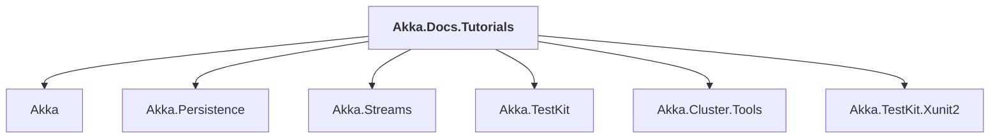

# Akka.Docs.Tutorials

## Overview

| Property | Value |
|----------|-------|
| Category | Test |
| Repository | akka.net |
| Path | `src/core/Akka.Docs.Tutorials/Akka.Docs.Tutorials.csproj` |
| Project References | 6 |
| NuGet Dependencies | 3 |
| Consumers | 0 |

## Dependency Diagram

## Project References
- Akka
- Akka.Persistence
- Akka.Streams
- Akka.TestKit
- Akka.Cluster.Tools
- Akka.TestKit.Xunit2

## External NuGet Packages
| Package | Version |
|---------|---------||
| FluentAssertions | 5.10.3 |
| xunit | 2.8.1 |
| xunit.runner.visualstudio | 2.8.1 |

---

*[Back to Index](../index.md)*
