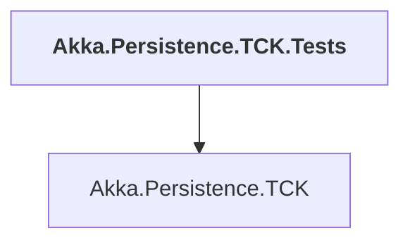

# Akka.Persistence.TCK.Tests

## Overview

| Property | Value |
|----------|-------|
| Category | Test |
| Repository | akka.net |
| Path | `src/core/Akka.Persistence.TCK.Tests/Akka.Persistence.TCK.Tests.csproj` |
| Project References | 1 |
| NuGet Dependencies | 4 |
| Consumers | 0 |

## Dependency Diagram

## Project References
- Akka.Persistence.TCK

## External NuGet Packages
| Package | Version |
|---------|---------||
| Microsoft.NET.Test.Sdk | 17.9.0 |
| xunit | 2.8.1 |
| xunit.runner.visualstudio | 2.8.1 |
| FluentAssertions | 5.10.3 |

---

*[Back to Index](../index.md)*
