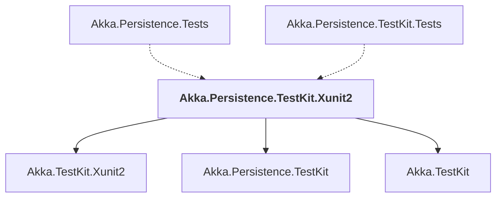

# Akka.Persistence.TestKit.Xunit2

## Overview

| Property | Value |
|----------|-------|
| Category | Test |
| Repository | akka.net |
| Path | `src/core/Akka.Persistence.TestKit.Xunit2/Akka.Persistence.TestKit.Xunit2.csproj` |
| Project References | 3 |
| NuGet Dependencies | 0 |
| Consumers | 2 |

## Dependency Diagram

## Project References
- Akka.TestKit.Xunit2
- Akka.Persistence.TestKit
- Akka.TestKit

## Consumed By
- Akka.Persistence.Tests
- Akka.Persistence.TestKit.Tests

---

*[Back to Index](../index.md)*
