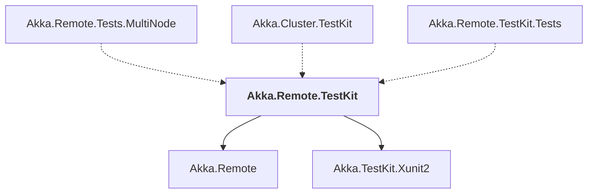

# Akka.Remote.TestKit

## Overview

| Property | Value |
|----------|-------|
| Category | Test |
| Repository | akka.net |
| Path | `src/core/Akka.Remote.TestKit/Akka.Remote.TestKit.csproj` |
| Project References | 2 |
| NuGet Dependencies | 3 |
| Consumers | 3 |

## Dependency Diagram

## Project References
- Akka.Remote
- Akka.TestKit.Xunit2

## Consumed By
- Akka.Remote.Tests.MultiNode
- Akka.Cluster.TestKit
- Akka.Remote.TestKit.Tests

## External NuGet Packages
| Package | Version |
|---------|---------||
| Google.Protobuf | 3.26.1 |
| Grpc.Tools | 2.60.0 |
| System.Collections.Specialized | 4.3.0 |

---

*[Back to Index](../index.md)*
