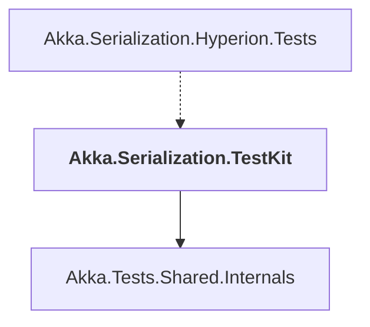

# Akka.Serialization.TestKit

## Overview

| Property | Value |
|----------|-------|
| Category | Test |
| Repository | akka.net |
| Path | `src/contrib/serializers/Akka.Serialization.TestKit/Akka.Serialization.TestKit.csproj` |
| Project References | 1 |
| NuGet Dependencies | 0 |
| Consumers | 1 |

## Dependency Diagram

## Project References
- Akka.Tests.Shared.Internals

## Consumed By
- Akka.Serialization.Hyperion.Tests

---

*[Back to Index](../index.md)*
