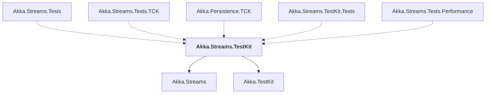

# Akka.Streams.TestKit

## Overview

| Property | Value |
|----------|-------|
| Category | Test |
| Repository | akka.net |
| Path | `src/core/Akka.Streams.TestKit/Akka.Streams.TestKit.csproj` |
| Project References | 2 |
| NuGet Dependencies | 1 |
| Consumers | 5 |

## Dependency Diagram

## Project References
- Akka.Streams
- Akka.TestKit

## Consumed By
- Akka.Streams.Tests
- Akka.Streams.Tests.TCK
- Akka.Persistence.TCK
- Akka.Streams.TestKit.Tests
- Akka.Streams.Tests.Performance

## External NuGet Packages
| Package | Version |
|---------|---------||
| Polyfill | 1.28.0 |

---

*[Back to Index](../index.md)*
