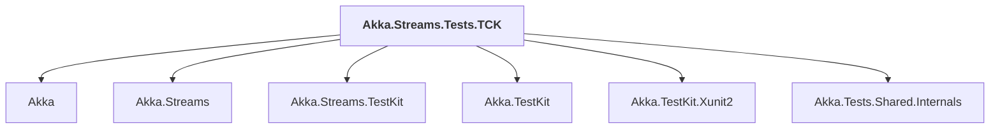

# Akka.Streams.Tests.TCK

## Overview

| Property | Value |
|----------|-------|
| Category | Test |
| Repository | akka.net |
| Path | `src/core/Akka.Streams.Tests.TCK/Akka.Streams.Tests.TCK.csproj` |
| Project References | 6 |
| NuGet Dependencies | 4 |
| Consumers | 0 |

## Dependency Diagram

## Project References
- Akka
- Akka.Streams
- Akka.Streams.TestKit
- Akka.TestKit
- Akka.TestKit.Xunit2
- Akka.Tests.Shared.Internals

## External NuGet Packages
| Package | Version |
|---------|---------||
| Microsoft.NET.Test.Sdk | 17.9.0 |
| NUnit3TestAdapter | 4.5.0 |
| Reactive.Streams.TCK | 1.0.4 |
| NUnit | 3.7.1 |

---

*[Back to Index](../index.md)*
