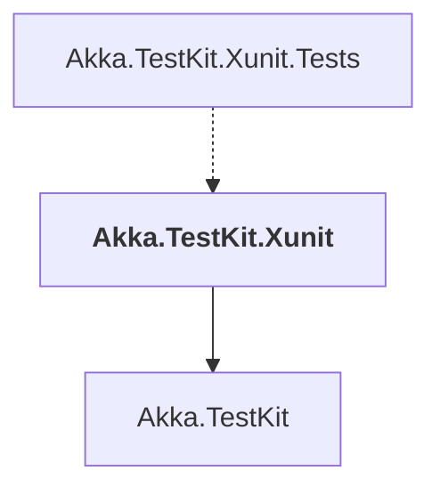

# Akka.TestKit.Xunit

## Overview

| Property | Value |
|----------|-------|
| Category | Test |
| Repository | akka.net |
| Path | `src/contrib/testkits/Akka.TestKit.Xunit/Akka.TestKit.Xunit.csproj` |
| Project References | 1 |
| NuGet Dependencies | 2 |
| Consumers | 1 |

## Dependency Diagram

## Project References
- Akka.TestKit

## Consumed By
- Akka.TestKit.Xunit.Tests

## External NuGet Packages
| Package | Version |
|---------|---------||
| xunit.v3.extensibility.core | 2.0.1 |
| xunit.v3.assert | 2.0.1 |

---

*[Back to Index](../index.md)*
