# Akka.TestKit.Xunit2

## Overview

| Property | Value |
|----------|-------|
| Category | Test |
| Repository | akka.net |
| Path | `src/contrib/testkits/Akka.TestKit.Xunit2/Akka.TestKit.Xunit2.csproj` |
| Project References | 1 |
| NuGet Dependencies | 1 |
| Consumers | 12 |

## Dependency Diagram

```mermaid
graph TD
    Akka_TestKit_Xunit2["<strong>Akka.TestKit.Xunit2</strong>"]
    Akka_TestKit["Akka.TestKit"]
    Akka_TestKit_Xunit2 --> Akka_TestKit
    Akka_TestKit_Xunit2_Tests["Akka.TestKit.Xunit2.Tests"]
    Akka_TestKit_Xunit2_Tests -.-> Akka_TestKit_Xunit2
    Akka_Docs_Tests["Akka.Docs.Tests"]
    Akka_Docs_Tests -.-> Akka_TestKit_Xunit2
    Akka_Remote_TestKit["Akka.Remote.TestKit"]
    Akka_Remote_TestKit -.-> Akka_TestKit_Xunit2
    Akka_TestKit_Tests["Akka.TestKit.Tests"]
    Akka_TestKit_Tests -.-> Akka_TestKit_Xunit2
    Akka_Streams_Tests_TCK["Akka.Streams.Tests.TCK"]
    Akka_Streams_Tests_TCK -.-> Akka_TestKit_Xunit2
    Akka_Discovery_Tests["Akka.Discovery.Tests"]
    Akka_Discovery_Tests -.-> Akka_TestKit_Xunit2
    Akka_API_Tests["Akka.API.Tests"]
    Akka_API_Tests -.-> Akka_TestKit_Xunit2
    Akka_Persistence_TestKit_Xunit2["Akka.Persistence.TestKit.Xunit2"]
    Akka_Persistence_TestKit_Xunit2 -.-> Akka_TestKit_Xunit2
    Akka_Persistence_TCK["Akka.Persistence.TCK"]
    Akka_Persistence_TCK -.-> Akka_TestKit_Xunit2
    Akka_Persistence_TestKit["Akka.Persistence.TestKit"]
    Akka_Persistence_TestKit -.-> Akka_TestKit_Xunit2
    Akka_Docs_Tutorials["Akka.Docs.Tutorials"]
    Akka_Docs_Tutorials -.-> Akka_TestKit_Xunit2
    Akka_Tests_Shared_Internals["Akka.Tests.Shared.Internals"]
    Akka_Tests_Shared_Internals -.-> Akka_TestKit_Xunit2
```

## Project References
- Akka.TestKit

## Consumed By
- Akka.TestKit.Xunit2.Tests
- Akka.Docs.Tests
- Akka.Remote.TestKit
- Akka.TestKit.Tests
- Akka.Streams.Tests.TCK
- Akka.Discovery.Tests
- Akka.API.Tests
- Akka.Persistence.TestKit.Xunit2
- Akka.Persistence.TCK
- Akka.Persistence.TestKit
- Akka.Docs.Tutorials
- Akka.Tests.Shared.Internals

## External NuGet Packages
| Package | Version |
|---------|---------||
| xunit | 2.8.1 |

---

*[Back to Index](../index.md)*
