# Akka.TestKit

## Overview

| Property | Value |
|----------|-------|
| Category | Test |
| Repository | akka.net |
| Path | `src/core/Akka.TestKit/Akka.TestKit.csproj` |
| Project References | 1 |
| NuGet Dependencies | 4 |
| Consumers | 11 |

## Dependency Diagram

```mermaid
graph TD
    Akka_TestKit["<strong>Akka.TestKit</strong>"]
    Akka["Akka"]
    Akka_TestKit --> Akka
    Akka_TestKit_Xunit2["Akka.TestKit.Xunit2"]
    Akka_TestKit_Xunit2 -.-> Akka_TestKit
    Akka_TestKit_Xunit["Akka.TestKit.Xunit"]
    Akka_TestKit_Xunit -.-> Akka_TestKit
    Akka_Tests_Performance["Akka.Tests.Performance"]
    Akka_Tests_Performance -.-> Akka_TestKit
    Akka_Docs_Tests["Akka.Docs.Tests"]
    Akka_Docs_Tests -.-> Akka_TestKit
    Akka_Streams_TestKit["Akka.Streams.TestKit"]
    Akka_Streams_TestKit -.-> Akka_TestKit
    Akka_TestKit_Tests["Akka.TestKit.Tests"]
    Akka_TestKit_Tests -.-> Akka_TestKit
    Akka_Streams_Tests_TCK["Akka.Streams.Tests.TCK"]
    Akka_Streams_Tests_TCK -.-> Akka_TestKit
    Akka_API_Tests["Akka.API.Tests"]
    Akka_API_Tests -.-> Akka_TestKit
    Akka_Persistence_TestKit_Xunit2["Akka.Persistence.TestKit.Xunit2"]
    Akka_Persistence_TestKit_Xunit2 -.-> Akka_TestKit
    Akka_Persistence_TestKit["Akka.Persistence.TestKit"]
    Akka_Persistence_TestKit -.-> Akka_TestKit
    Akka_Docs_Tutorials["Akka.Docs.Tutorials"]
    Akka_Docs_Tutorials -.-> Akka_TestKit
```

## Project References
- Akka

## Consumed By
- Akka.TestKit.Xunit2
- Akka.TestKit.Xunit
- Akka.Tests.Performance
- Akka.Docs.Tests
- Akka.Streams.TestKit
- Akka.TestKit.Tests
- Akka.Streams.Tests.TCK
- Akka.API.Tests
- Akka.Persistence.TestKit.Xunit2
- Akka.Persistence.TestKit
- Akka.Docs.Tutorials

## External NuGet Packages
| Package | Version |
|---------|---------||
| Microsoft.Bcl.AsyncInterfaces | [6.0.*,) |
| Nito.AsyncEx.Coordination | 5.1.2 |
| Nito.AsyncEx.Context | 5.1.2 |
| System.Linq.Async | 6.0.1 |

---

*[Back to Index](../index.md)*
