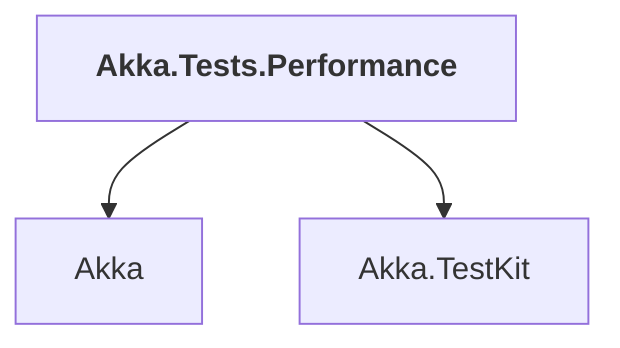

# Akka.Tests.Performance

## Overview

| Property | Value |
|----------|-------|
| Category | Test |
| Repository | akka.net |
| Path | `src/core/Akka.Tests.Performance/Akka.Tests.Performance.csproj` |
| Project References | 2 |
| NuGet Dependencies | 1 |
| Consumers | 0 |

## Dependency Diagram

## Project References
- Akka
- Akka.TestKit

## External NuGet Packages
| Package | Version |
|---------|---------||
| NBench | 2.0.1 |

---

*[Back to Index](../index.md)*
