# Akka.Tests.Shared.Internals

## Overview

| Property | Value |
|----------|-------|
| Category | Test |
| Repository | akka.net |
| Path | `src/core/Akka.Tests.Shared.Internals/Akka.Tests.Shared.Internals.csproj` |
| Project References | 1 |
| NuGet Dependencies | 3 |
| Consumers | 23 |

## Dependency Diagram

```mermaid
graph TD
    Akka_Tests_Shared_Internals["<strong>Akka.Tests.Shared.Internals</strong>"]
    Akka_TestKit_Xunit2["Akka.TestKit.Xunit2"]
    Akka_Tests_Shared_Internals --> Akka_TestKit_Xunit2
    Akka_DependencyInjection_Tests["Akka.DependencyInjection.Tests"]
    Akka_DependencyInjection_Tests -.-> Akka_Tests_Shared_Internals
    Akka_Cluster_Tools_Tests_MultiNode["Akka.Cluster.Tools.Tests.MultiNode"]
    Akka_Cluster_Tools_Tests_MultiNode -.-> Akka_Tests_Shared_Internals
    Akka_Cluster_Sharding_Tests["Akka.Cluster.Sharding.Tests"]
    Akka_Cluster_Sharding_Tests -.-> Akka_Tests_Shared_Internals
    Akka_DistributedData_Tests_MultiNode["Akka.DistributedData.Tests.MultiNode"]
    Akka_DistributedData_Tests_MultiNode -.-> Akka_Tests_Shared_Internals
    Akka_Cluster_Tools_Tests["Akka.Cluster.Tools.Tests"]
    Akka_Cluster_Tools_Tests -.-> Akka_Tests_Shared_Internals
    Akka_Cluster_Sharding_Tests_MultiNode["Akka.Cluster.Sharding.Tests.MultiNode"]
    Akka_Cluster_Sharding_Tests_MultiNode -.-> Akka_Tests_Shared_Internals
    Akka_DistributedData_Tests["Akka.DistributedData.Tests"]
    Akka_DistributedData_Tests -.-> Akka_Tests_Shared_Internals
    Akka_Serialization_TestKit["Akka.Serialization.TestKit"]
    Akka_Serialization_TestKit -.-> Akka_Tests_Shared_Internals
    Akka_Serialization_Hyperion_Tests["Akka.Serialization.Hyperion.Tests"]
    Akka_Serialization_Hyperion_Tests -.-> Akka_Tests_Shared_Internals
    Akka_Persistence_Tests["Akka.Persistence.Tests"]
    Akka_Persistence_Tests -.-> Akka_Tests_Shared_Internals
    Akka_Remote_Tests_MultiNode["Akka.Remote.Tests.MultiNode"]
    Akka_Remote_Tests_MultiNode -.-> Akka_Tests_Shared_Internals
    Akka_Cluster_Tests_MultiNode["Akka.Cluster.Tests.MultiNode"]
    Akka_Cluster_Tests_MultiNode -.-> Akka_Tests_Shared_Internals
    Akka_Streams_Tests["Akka.Streams.Tests"]
    Akka_Streams_Tests -.-> Akka_Tests_Shared_Internals
    Akka_TestKit_Tests["Akka.TestKit.Tests"]
    Akka_TestKit_Tests -.-> Akka_Tests_Shared_Internals
    Akka_Streams_Tests_TCK["Akka.Streams.Tests.TCK"]
    Akka_Streams_Tests_TCK -.-> Akka_Tests_Shared_Internals
    more_consumers["... +8 more"]
    more_consumers -.-> Akka_Tests_Shared_Internals
```

## Project References
- Akka.TestKit.Xunit2

## Consumed By
- Akka.DependencyInjection.Tests
- Akka.Cluster.Tools.Tests.MultiNode
- Akka.Cluster.Sharding.Tests
- Akka.DistributedData.Tests.MultiNode
- Akka.Cluster.Tools.Tests
- Akka.Cluster.Sharding.Tests.MultiNode
- Akka.DistributedData.Tests
- Akka.Serialization.TestKit
- Akka.Serialization.Hyperion.Tests
- Akka.Persistence.Tests
- Akka.Remote.Tests.MultiNode
- Akka.Cluster.Tests.MultiNode
- Akka.Streams.Tests
- Akka.TestKit.Tests
- Akka.Streams.Tests.TCK
- Akka.Coordination.Tests
- Akka.Persistence.Query.Tests
- Akka.Persistence.TestKit.Tests
- Akka.Remote.Tests
- Akka.Streams.TestKit.Tests
- Akka.Tests
- Akka.Cluster.Tests
- Akka.Remote.TestKit.Tests

## External NuGet Packages
| Package | Version |
|---------|---------||
| System.Diagnostics.StackTrace | 4.3.0 |
| FsCheck.Xunit | 2.16.6 |
| Fsharp.Core | 6.0.5 |

---

*[Back to Index](../index.md)*
