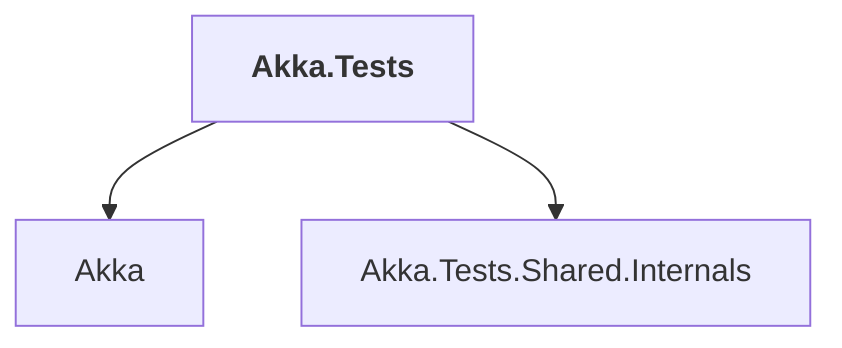

# Akka.Tests

## Overview

| Property | Value |
|----------|-------|
| Category | Test |
| Repository | akka.net |
| Path | `src/core/Akka.Tests/Akka.Tests.csproj` |
| Project References | 2 |
| NuGet Dependencies | 7 |
| Consumers | 0 |

## Dependency Diagram

## Project References
- Akka
- Akka.Tests.Shared.Internals

## External NuGet Packages
| Package | Version |
|---------|---------||
| Microsoft.NET.Test.Sdk | 17.9.0 |
| xunit | 2.8.1 |
| xunit.runner.visualstudio | 2.8.1 |
| FluentAssertions | 5.10.3 |
| FsCheck.Xunit | 2.16.6 |
| Xunit.SkippableFact | 1.4.13 |
| System.Linq.Async | 6.0.1 |

---

*[Back to Index](../index.md)*
