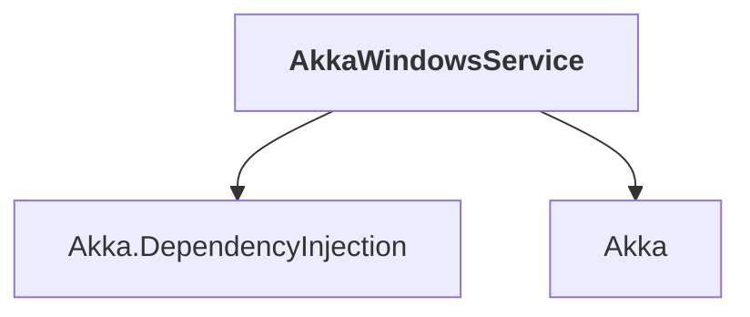

# AkkaWindowsService

## Overview

| Property | Value |
|----------|-------|
| Category | Service |
| Repository | akka.net |
| Path | `src/examples/WindowsService/AkkaWindowsService/AkkaWindowsService.csproj` |
| Project References | 2 |
| NuGet Dependencies | 2 |
| Consumers | 0 |

## Dependency Diagram

## Project References
- Akka.DependencyInjection
- Akka

## External NuGet Packages
| Package | Version |
|---------|---------||
| Microsoft.Extensions.Hosting.WindowsServices | [6.0.*,) |
| Microsoft.Extensions.Http | [6.0.*,) |

---

*[Back to Index](../index.md)*
