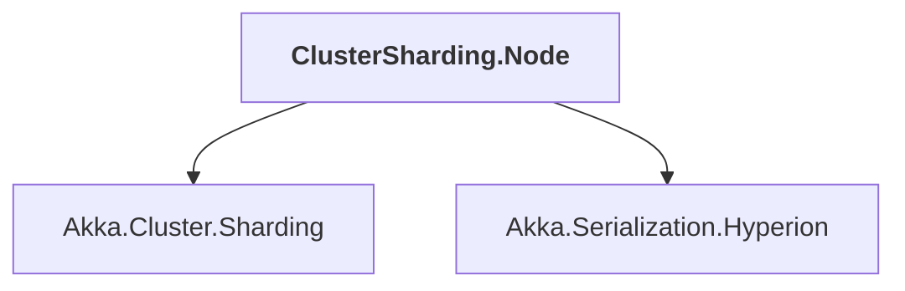

# ClusterSharding.Node

## Overview

| Property | Value |
|----------|-------|
| Category | Application |
| Repository | akka.net |
| Path | `src/examples/Cluster/ClusterSharding/ClusterSharding.Node/ClusterSharding.Node.csproj` |
| Project References | 2 |
| NuGet Dependencies | 4 |
| Consumers | 0 |

## Dependency Diagram

## Project References
- Akka.Cluster.Sharding
- Akka.Serialization.Hyperion

## External NuGet Packages
| Package | Version |
|---------|---------||
| Akka.Bootstrap.Docker | 0.5.3 |
| Akka.Persistence.Sql | 1.5.44 |
| Microsoft.Data.Sqlite | 8.0.14 |
| Microsoft.Data.Sqlite.Core | 8.0.14 |

---

*[Back to Index](../index.md)*
