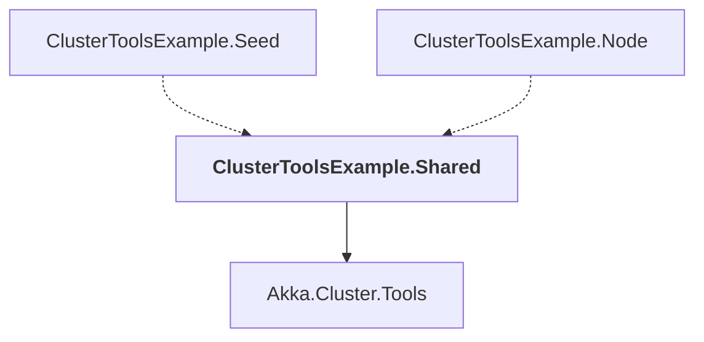

# ClusterToolsExample.Shared

## Overview

| Property | Value |
|----------|-------|
| Category | Sample |
| Repository | akka.net |
| Path | `src/examples/Cluster/ClusterTools/ClusterToolsExample.Shared/ClusterToolsExample.Shared.csproj` |
| Project References | 1 |
| NuGet Dependencies | 0 |
| Consumers | 2 |

## Dependency Diagram

## Project References
- Akka.Cluster.Tools

## Consumed By
- ClusterToolsExample.Seed
- ClusterToolsExample.Node

---

*[Back to Index](../index.md)*
