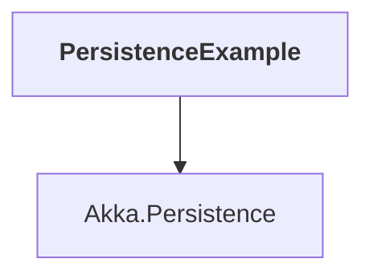

# PersistenceExample

## Overview

| Property | Value |
|----------|-------|
| Category | Sample |
| Repository | akka.net |
| Path | `src/examples/PersistenceExample/PersistenceExample.csproj` |
| Project References | 1 |
| NuGet Dependencies | 0 |
| Consumers | 0 |

## Dependency Diagram

## Project References
- Akka.Persistence

---

*[Back to Index](../index.md)*
