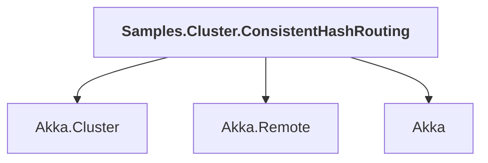

# Samples.Cluster.ConsistentHashRouting

## Overview

| Property | Value |
|----------|-------|
| Category | Sample |
| Repository | akka.net |
| Path | `src/examples/Cluster/Routing/Samples.Cluster.ConsistentHashRouting/Samples.Cluster.ConsistentHashRouting.csproj` |
| Project References | 3 |
| NuGet Dependencies | 0 |
| Consumers | 0 |

## Dependency Diagram

## Project References
- Akka.Cluster
- Akka.Remote
- Akka

---

*[Back to Index](../index.md)*
