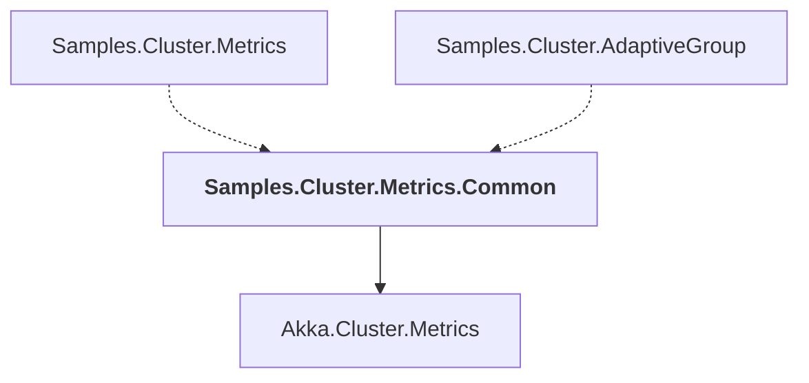

# Samples.Cluster.Metrics.Common

## Overview

| Property | Value |
|----------|-------|
| Category | Sample |
| Repository | akka.net |
| Path | `src/examples/Cluster/Metrics/Samples.Cluster.Metrics.Common/Samples.Cluster.Metrics.Common.csproj` |
| Project References | 1 |
| NuGet Dependencies | 0 |
| Consumers | 2 |

## Dependency Diagram

## Project References
- Akka.Cluster.Metrics

## Consumed By
- Samples.Cluster.Metrics
- Samples.Cluster.AdaptiveGroup

---

*[Back to Index](../index.md)*
