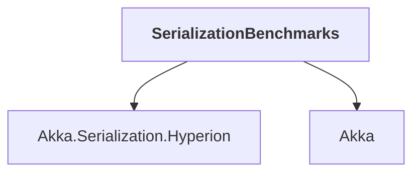

# SerializationBenchmarks

## Overview

| Property | Value |
|----------|-------|
| Category | Application |
| Repository | akka.net |
| Path | `src/benchmark/SerializationBenchmarks/SerializationBenchmarks.csproj` |
| Project References | 2 |
| NuGet Dependencies | 1 |
| Consumers | 0 |

## Dependency Diagram

## Project References
- Akka.Serialization.Hyperion
- Akka

## External NuGet Packages
| Package | Version |
|---------|---------||
| BenchmarkDotNet | 0.13.11 |

---

*[Back to Index](../index.md)*
