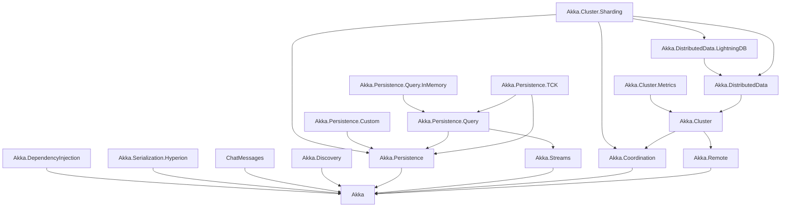
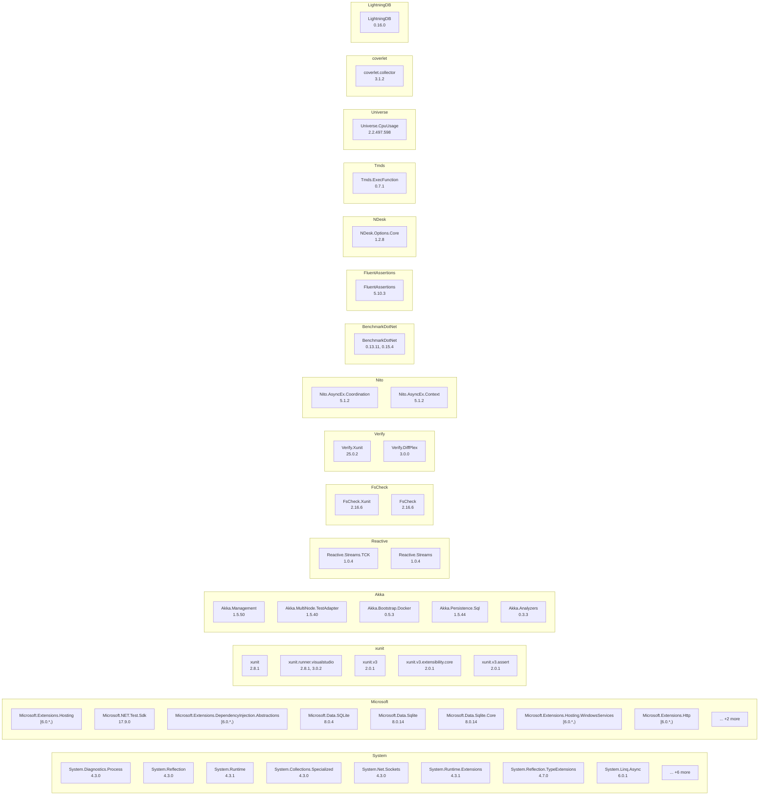

# Dependency Map

## Overview

| Metric | Count |
|--------|-------|
| Repositories | 1 |
| Total Projects | 109 |
| NuGet Packages | 65 |
| Project References | 248 |
| Data Access Findings | 1860 |
| Config Files | 29 |

## Project Categories

| Category | Count |
|----------|-------|
| Test | 48 |
| Application | 19 |
| Library | 18 |
| Sample | 16 |
| Tool | 3 |
| Service | 3 |
| WebApp | 1 |
| DesktopApp | 1 |

## Full Landscape

```mermaid
graph LR
    subgraph Applications
        akka_net_SerializationBenchmarks["SerializationBenchmarks"]
        akka_net_Akka_Benchmarks["Akka.Benchmarks"]
        akka_net_Akka_Cluster_Benchmarks["Akka.Cluster.Benchmarks"]
        akka_net_RemotePingPong["RemotePingPong"]
        akka_net_Akka_Cluster_Cpu_Benchmark["Akka.Cluster.Cpu.Benchmark"]
        akka_net_PingPong["PingPong"]
        akka_net_SpawnBenchmark["SpawnBenchmark"]
        akka_net_TimeServer["TimeServer"]
        akka_net_System1["System1"]
        akka_net_System2["System2"]
        akka_net_Shared["Shared"]
        akka_net_ClusterSharding_Node["ClusterSharding.Node"]
        akka_net_ShoppingCart["ShoppingCart"]
        akka_net_HelloAkka["HelloAkka"]
        akka_net_Routing["Routing"]
        akka_net_HelloWorld["HelloWorld"]
        akka_net_ChatServer["ChatServer"]
        akka_net_AppConfig["AppConfig"]
        akka_net_FaultTolerance["FaultTolerance"]
    end
    subgraph Tests
        akka_net_Akka_DependencyInjection_Tests["Akka.DependencyInjection.Tests"]
        akka_net_Akka_TestKit_Xunit_Tests["Akka.TestKit.Xunit.Tests"]
        akka_net_Akka_TestKit_Xunit2["Akka.TestKit.Xunit2"]
        akka_net_Akka_TestKit_Xunit2_Tests["Akka.TestKit.Xunit2.Tests"]
        akka_net_Akka_TestKit_Xunit["Akka.TestKit.Xunit"]
        akka_net_Akka_Cluster_Tools_Tests_MultiNode["Akka.Cluster.Tools.Tests.MultiNode"]
        akka_net_Akka_Cluster_Sharding_Tests["Akka.Cluster.Sharding.Tests"]
        akka_net_Akka_DistributedData_Tests_MultiNode["Akka.DistributedData.Tests.MultiNode"]
        akka_net_Akka_Cluster_Metrics_Tests["Akka.Cluster.Metrics.Tests"]
        akka_net_Akka_Cluster_Tools_Tests["Akka.Cluster.Tools.Tests"]
        akka_net_Akka_Cluster_Sharding_Tests_MultiNode["Akka.Cluster.Sharding.Tests.MultiNode"]
        akka_net_Akka_DistributedData_Tests["Akka.DistributedData.Tests"]
        akka_net_Akka_Cluster_Metrics_Tests_MultiNode["Akka.Cluster.Metrics.Tests.MultiNode"]
        akka_net_Akka_Persistence_Query_InMemory_Tests["Akka.Persistence.Query.InMemory.Tests"]
        akka_net_Akka_Serialization_TestKit["Akka.Serialization.TestKit"]
        akka_net_Akka_Serialization_Hyperion_Tests["Akka.Serialization.Hyperion.Tests"]
        akka_net_Akka_Persistence_Custom_Tests["Akka.Persistence.Custom.Tests"]
        akka_net_DDataStressTest["DDataStressTest"]
        akka_net_Akka_Persistence_Tests["Akka.Persistence.Tests"]
        akka_net_Akka_Tests_Performance["Akka.Tests.Performance"]
        akka_net_Akka_Docs_Tests["Akka.Docs.Tests"]
        akka_net_Akka_Remote_Tests_MultiNode["Akka.Remote.Tests.MultiNode"]
        akka_net_Akka_Remote_TestKit["Akka.Remote.TestKit"]
        akka_net_Akka_Cluster_Tests_MultiNode["Akka.Cluster.Tests.MultiNode"]
        akka_net_Akka_Streams_Tests["Akka.Streams.Tests"]
        akka_net_Akka_Cluster_TestKit["Akka.Cluster.TestKit"]
        akka_net_Akka_Streams_TestKit["Akka.Streams.TestKit"]
        akka_net_Akka_Remote_Tests_Performance["Akka.Remote.Tests.Performance"]
        akka_net_Akka_TestKit_Tests["Akka.TestKit.Tests"]
        akka_net_Akka_Streams_Tests_TCK["Akka.Streams.Tests.TCK"]
        akka_net_Akka_Discovery_Tests["Akka.Discovery.Tests"]
        akka_net_Akka_Coordination_Tests["Akka.Coordination.Tests"]
        akka_net_Akka_Persistence_Query_Tests["Akka.Persistence.Query.Tests"]
        akka_net_Akka_Persistence_TCK_Tests["Akka.Persistence.TCK.Tests"]
        akka_net_Akka_API_Tests["Akka.API.Tests"]
        akka_net_Akka_Persistence_TestKit_Tests["Akka.Persistence.TestKit.Tests"]
        akka_net_Akka_Persistence_TestKit_Xunit2["Akka.Persistence.TestKit.Xunit2"]
        akka_net_Akka_Cluster_Tests_Performance["Akka.Cluster.Tests.Performance"]
        akka_net_Akka_Remote_Tests["Akka.Remote.Tests"]
        akka_net_Akka_Persistence_TestKit["Akka.Persistence.TestKit"]
        akka_net_Akka_Streams_TestKit_Tests["Akka.Streams.TestKit.Tests"]
        akka_net_Akka_Tests["Akka.Tests"]
        akka_net_Akka_Cluster_Tests["Akka.Cluster.Tests"]
        akka_net_Akka_TestKit["Akka.TestKit"]
        akka_net_Akka_Docs_Tutorials["Akka.Docs.Tutorials"]
        akka_net_Akka_Streams_Tests_Performance["Akka.Streams.Tests.Performance"]
        akka_net_Akka_Remote_TestKit_Tests["Akka.Remote.TestKit.Tests"]
        akka_net_Akka_Tests_Shared_Internals["Akka.Tests.Shared.Internals"]
    end
    subgraph Librarys
        akka_net_Akka_DependencyInjection["Akka.DependencyInjection"]
        akka_net_Akka_DistributedData_LightningDB["Akka.DistributedData.LightningDB"]
        akka_net_Akka_Cluster_Metrics["Akka.Cluster.Metrics"]
        akka_net_Akka_DistributedData["Akka.DistributedData"]
        akka_net_Akka_Cluster_Sharding["Akka.Cluster.Sharding"]
        akka_net_Akka_Persistence_Query_InMemory["Akka.Persistence.Query.InMemory"]
        akka_net_Akka_Serialization_Hyperion["Akka.Serialization.Hyperion"]
        akka_net_Akka_Persistence_Custom["Akka.Persistence.Custom"]
        akka_net_ChatMessages["ChatMessages"]
        akka_net_Akka_Discovery["Akka.Discovery"]
        akka_net_Akka_Cluster["Akka.Cluster"]
        akka_net_Akka_Persistence_Query["Akka.Persistence.Query"]
        akka_net_Akka_Persistence_TCK["Akka.Persistence.TCK"]
        akka_net_Akka_Persistence["Akka.Persistence"]
        akka_net_Akka_Streams["Akka.Streams"]
        akka_net_Akka_Coordination["Akka.Coordination"]
        akka_net_Akka_Remote["Akka.Remote"]
        akka_net_Akka["Akka"]
    end
    subgraph Tools
        akka_net_Akka_Cluster_Tools["Akka.Cluster.Tools"]
        akka_net_TimeClient["TimeClient"]
        akka_net_ChatClient["ChatClient"]
    end
    subgraph Webapps
        akka_net_Akka_AspNetCore["Akka.AspNetCore"]
    end
    subgraph Services
        akka_net_TcpEchoService_Server["TcpEchoService.Server"]
        akka_net_AkkaWindowsService["AkkaWindowsService"]
        akka_net_AkkaHeadlesssService["AkkaHeadlesssService"]
    end
    subgraph Desktopapps
        akka_net_SymbolLookup["SymbolLookup"]
    end
    akka_net_SerializationBenchmarks --> akka_net_Akka_Serialization_Hyperion
    akka_net_SerializationBenchmarks --> akka_net_Akka
    akka_net_Akka_Benchmarks --> akka_net_Akka_DistributedData
    akka_net_Akka_Benchmarks --> akka_net_Akka_Serialization_Hyperion
    akka_net_Akka_Benchmarks --> akka_net_Akka_Cluster
    akka_net_Akka_Benchmarks --> akka_net_Akka_Persistence
    akka_net_Akka_Benchmarks --> akka_net_Akka_Remote
    akka_net_Akka_Benchmarks --> akka_net_Akka_Streams
    akka_net_Akka_Benchmarks --> akka_net_Akka
    akka_net_Akka_Cluster_Benchmarks --> akka_net_Akka_Cluster_Sharding
    akka_net_RemotePingPong --> akka_net_Akka_Remote
    akka_net_Akka_Cluster_Cpu_Benchmark --> akka_net_Akka_Cluster
    akka_net_PingPong --> akka_net_Akka
    akka_net_SpawnBenchmark --> akka_net_Akka
    akka_net_Akka_DependencyInjection_Tests --> akka_net_Akka_Tests_Shared_Internals
    akka_net_Akka_DependencyInjection_Tests --> akka_net_Akka_DependencyInjection
    akka_net_Akka_DependencyInjection --> akka_net_Akka
    akka_net_Akka_TestKit_Xunit_Tests --> akka_net_Akka_TestKit_Xunit
    akka_net_Akka_TestKit_Xunit2 --> akka_net_Akka_TestKit
    akka_net_Akka_TestKit_Xunit2_Tests --> akka_net_Akka_TestKit_Xunit2
    akka_net_Akka_TestKit_Xunit --> akka_net_Akka_TestKit
    akka_net_Akka_Cluster_Tools_Tests_MultiNode --> akka_net_Akka_Coordination_Tests
    akka_net_Akka_Cluster_Tools_Tests_MultiNode --> akka_net_Akka_Cluster_Tools
    akka_net_Akka_Cluster_Tools_Tests_MultiNode --> akka_net_Akka_Cluster_TestKit
    akka_net_Akka_Cluster_Tools_Tests_MultiNode --> akka_net_Akka_Tests_Shared_Internals
    akka_net_Akka_Cluster_Sharding_Tests --> akka_net_Akka_Coordination_Tests
    akka_net_Akka_Cluster_Sharding_Tests --> akka_net_Akka_Cluster_Sharding
    akka_net_Akka_Cluster_Sharding_Tests --> akka_net_Akka_Persistence
    akka_net_Akka_Cluster_Sharding_Tests --> akka_net_Akka_Tests_Shared_Internals
    akka_net_Akka_DistributedData_LightningDB --> akka_net_Akka_DistributedData
    akka_net_Akka_Cluster_Metrics --> akka_net_Akka_Cluster
    akka_net_Akka_DistributedData_Tests_MultiNode --> akka_net_Akka_DistributedData_LightningDB
    akka_net_Akka_DistributedData_Tests_MultiNode --> akka_net_Akka_DistributedData
    akka_net_Akka_DistributedData_Tests_MultiNode --> akka_net_Akka_Cluster_TestKit
    akka_net_Akka_DistributedData_Tests_MultiNode --> akka_net_Akka_Tests_Shared_Internals
    akka_net_Akka_DistributedData --> akka_net_Akka_Cluster
    akka_net_Akka_Cluster_Metrics_Tests --> akka_net_Akka_Cluster_Metrics
    akka_net_Akka_Cluster_Metrics_Tests --> akka_net_Akka_Cluster_Tests
    akka_net_Akka_Cluster_Tools_Tests --> akka_net_Akka_Coordination_Tests
    akka_net_Akka_Cluster_Tools_Tests --> akka_net_Akka_Cluster_Tools
    akka_net_Akka_Cluster_Tools_Tests --> akka_net_Akka_Tests_Shared_Internals
    akka_net_Akka_Cluster_Sharding_Tests_MultiNode --> akka_net_Akka_Serialization_Hyperion
    akka_net_Akka_Cluster_Sharding_Tests_MultiNode --> akka_net_Akka_Cluster_Sharding
    akka_net_Akka_Cluster_Sharding_Tests_MultiNode --> akka_net_Akka_Cluster_TestKit
    akka_net_Akka_Cluster_Sharding_Tests_MultiNode --> akka_net_Akka_Tests_Shared_Internals
    akka_net_Akka_Cluster_Sharding_Tests_MultiNode --> akka_net_Akka_DistributedData_LightningDB
    akka_net_Akka_DistributedData_Tests --> akka_net_Akka_Cluster_Sharding
    akka_net_Akka_DistributedData_Tests --> akka_net_Akka_DistributedData_LightningDB
    akka_net_Akka_DistributedData_Tests --> akka_net_Akka_DistributedData
    akka_net_Akka_DistributedData_Tests --> akka_net_Akka_Tests_Shared_Internals
    akka_net_Akka_Cluster_Metrics_Tests_MultiNode --> akka_net_Akka_Cluster_Metrics_Tests
    akka_net_Akka_Cluster_Metrics_Tests_MultiNode --> akka_net_Akka_Cluster_Metrics
    akka_net_Akka_Cluster_Metrics_Tests_MultiNode --> akka_net_Akka_Cluster_TestKit
    akka_net_Akka_Cluster_Tools --> akka_net_Akka_Cluster
    akka_net_Akka_Cluster_Tools --> akka_net_Akka_Coordination
    akka_net_Akka_Cluster_Tools --> akka_net_Akka_Discovery
    akka_net_Akka_Cluster_Sharding --> akka_net_Akka_Coordination
    akka_net_Akka_Cluster_Sharding --> akka_net_Akka_Persistence
    akka_net_Akka_Cluster_Sharding --> akka_net_Akka_Cluster_Tools
    akka_net_Akka_Cluster_Sharding --> akka_net_Akka_DistributedData_LightningDB
    akka_net_Akka_Cluster_Sharding --> akka_net_Akka_DistributedData
    akka_net_Akka_Persistence_Query_InMemory --> akka_net_Akka_Persistence_Query
    akka_net_Akka_Persistence_Query_InMemory_Tests --> akka_net_Akka_Persistence_TCK
    akka_net_Akka_Persistence_Query_InMemory_Tests --> akka_net_Akka_Persistence_Query_InMemory
    akka_net_Akka_Serialization_TestKit --> akka_net_Akka_Tests_Shared_Internals
    akka_net_Akka_Serialization_Hyperion --> akka_net_Akka
    akka_net_Akka_Serialization_Hyperion_Tests --> akka_net_Akka_Serialization_Hyperion
    akka_net_Akka_Serialization_Hyperion_Tests --> akka_net_Akka_Serialization_TestKit
    akka_net_Akka_Serialization_Hyperion_Tests --> akka_net_Akka_Tests_Shared_Internals
    akka_net_Akka_AspNetCore --> akka_net_Akka_DependencyInjection
    akka_net_Akka_AspNetCore --> akka_net_Akka
    akka_net_TimeClient --> akka_net_Akka_Remote
    akka_net_TimeClient --> akka_net_Akka
    akka_net_TimeServer --> akka_net_Akka_Remote
    akka_net_TimeServer --> akka_net_Akka
    akka_net_Akka_Persistence_Custom --> akka_net_Akka_Persistence
    akka_net_System1 --> akka_net_Akka_Remote
    akka_net_System1 --> akka_net_Akka
    akka_net_System1 --> akka_net_Shared
    akka_net_System2 --> akka_net_Akka_Remote
    akka_net_System2 --> akka_net_Akka
    akka_net_System2 --> akka_net_Shared
    akka_net_Shared --> akka_net_Akka
    akka_net_Akka_Persistence_Custom_Tests --> akka_net_Akka_Persistence_TCK
    akka_net_Akka_Persistence_Custom_Tests --> akka_net_Akka_Persistence_Custom
    akka_net_ClusterSharding_Node --> akka_net_Akka_Cluster_Sharding
    akka_net_ClusterSharding_Node --> akka_net_Akka_Serialization_Hyperion
    akka_net_ShoppingCart --> akka_net_Akka_Cluster_Sharding
    akka_net_DDataStressTest --> akka_net_Akka_DistributedData
    akka_net_TcpEchoService_Server --> akka_net_Akka
    akka_net_HelloAkka --> akka_net_Akka
    akka_net_Routing --> akka_net_Akka
    akka_net_AkkaWindowsService --> akka_net_Akka_DependencyInjection
    akka_net_AkkaWindowsService --> akka_net_Akka
    akka_net_HelloWorld --> akka_net_Akka
    akka_net_AkkaHeadlesssService --> akka_net_Akka_DependencyInjection
    akka_net_AkkaHeadlesssService --> akka_net_Akka
    akka_net_SymbolLookup --> akka_net_Akka
    akka_net_ChatClient --> akka_net_Akka_Remote
    akka_net_ChatClient --> akka_net_ChatMessages
    akka_net_ChatServer --> akka_net_Akka_Remote
    akka_net_ChatServer --> akka_net_ChatMessages
    akka_net_ChatMessages --> akka_net_Akka
    akka_net_FaultTolerance --> akka_net_Akka
    akka_net_Akka_Persistence_Tests --> akka_net_Akka_Serialization_Hyperion
    akka_net_Akka_Persistence_Tests --> akka_net_Akka_Persistence_TestKit_Xunit2
    akka_net_Akka_Persistence_Tests --> akka_net_Akka_Persistence
    akka_net_Akka_Persistence_Tests --> akka_net_Akka_Remote
    akka_net_Akka_Persistence_Tests --> akka_net_Akka_Tests_Shared_Internals
    akka_net_Akka_Tests_Performance --> akka_net_Akka
    akka_net_Akka_Tests_Performance --> akka_net_Akka_TestKit
    akka_net_Akka_Docs_Tests --> akka_net_Akka_Cluster_Metrics
    akka_net_Akka_Docs_Tests --> akka_net_Akka_Coordination_Tests
    akka_net_Akka_Docs_Tests --> akka_net_Akka
    akka_net_Akka_Docs_Tests --> akka_net_Akka_Persistence
    akka_net_Akka_Docs_Tests --> akka_net_Akka_Streams
    akka_net_Akka_Docs_Tests --> akka_net_Akka_TestKit
    akka_net_Akka_Docs_Tests --> akka_net_Akka_Cluster_Tools
    akka_net_Akka_Docs_Tests --> akka_net_Akka_TestKit_Xunit2
    akka_net_Akka_Remote_Tests_MultiNode --> akka_net_Akka_Remote_TestKit
    akka_net_Akka_Remote_Tests_MultiNode --> akka_net_Akka_Tests_Shared_Internals
    akka_net_Akka_Remote_TestKit --> akka_net_Akka_Remote
    akka_net_Akka_Remote_TestKit --> akka_net_Akka_TestKit_Xunit2
    akka_net_Akka_Cluster_Tests_MultiNode --> akka_net_Akka_Cluster_TestKit
    akka_net_Akka_Cluster_Tests_MultiNode --> akka_net_Akka_Coordination_Tests
    akka_net_Akka_Cluster_Tests_MultiNode --> akka_net_Akka_Tests_Shared_Internals
    akka_net_Akka_Discovery --> akka_net_Akka
    akka_net_Akka_Streams_Tests --> akka_net_Akka_Remote
    akka_net_Akka_Streams_Tests --> akka_net_Akka_Streams
    akka_net_Akka_Streams_Tests --> akka_net_Akka_Streams_TestKit
    akka_net_Akka_Streams_Tests --> akka_net_Akka_Tests_Shared_Internals
    akka_net_Akka_Cluster_TestKit --> akka_net_Akka_Remote_TestKit
    akka_net_Akka_Cluster_TestKit --> akka_net_Akka_Cluster
    akka_net_Akka_Streams_TestKit --> akka_net_Akka_Streams
    akka_net_Akka_Streams_TestKit --> akka_net_Akka_TestKit
    akka_net_Akka_Remote_Tests_Performance --> akka_net_Akka_Remote
    akka_net_Akka_Cluster --> akka_net_Akka_Coordination
    akka_net_Akka_Cluster --> akka_net_Akka_Remote
    akka_net_Akka_TestKit_Tests --> akka_net_Akka
    akka_net_Akka_TestKit_Tests --> akka_net_Akka_TestKit
    akka_net_Akka_TestKit_Tests --> akka_net_Akka_TestKit_Xunit2
    akka_net_Akka_TestKit_Tests --> akka_net_Akka_Tests_Shared_Internals
    akka_net_Akka_Streams_Tests_TCK --> akka_net_Akka
    akka_net_Akka_Streams_Tests_TCK --> akka_net_Akka_Streams
    akka_net_Akka_Streams_Tests_TCK --> akka_net_Akka_Streams_TestKit
    akka_net_Akka_Streams_Tests_TCK --> akka_net_Akka_TestKit
    akka_net_Akka_Streams_Tests_TCK --> akka_net_Akka_TestKit_Xunit2
    akka_net_Akka_Streams_Tests_TCK --> akka_net_Akka_Tests_Shared_Internals
    akka_net_Akka_Discovery_Tests --> akka_net_Akka_TestKit_Xunit2
    akka_net_Akka_Discovery_Tests --> akka_net_Akka_Discovery
    akka_net_Akka_Coordination_Tests --> akka_net_Akka_Coordination
    akka_net_Akka_Coordination_Tests --> akka_net_Akka_Tests_Shared_Internals
    akka_net_Akka_Persistence_Query_Tests --> akka_net_Akka_Persistence_Query
    akka_net_Akka_Persistence_Query_Tests --> akka_net_Akka_Tests_Shared_Internals
    akka_net_Akka_Persistence_TCK_Tests --> akka_net_Akka_Persistence_TCK
    akka_net_Akka_API_Tests --> akka_net_Akka_Cluster_Metrics
    akka_net_Akka_API_Tests --> akka_net_Akka_Cluster_Sharding
    akka_net_Akka_API_Tests --> akka_net_Akka_DistributedData
    akka_net_Akka_API_Tests --> akka_net_Akka_Persistence_Query_InMemory
    akka_net_Akka_API_Tests --> akka_net_Akka_TestKit_Xunit2
    akka_net_Akka_API_Tests --> akka_net_Akka_Coordination
    akka_net_Akka_API_Tests --> akka_net_Akka_Discovery
    akka_net_Akka_API_Tests --> akka_net_Akka_Persistence_Query
    akka_net_Akka_API_Tests --> akka_net_Akka_TestKit
    akka_net_Akka_API_Tests --> akka_net_Akka
    akka_net_Akka_API_Tests --> akka_net_Akka_Cluster
    akka_net_Akka_API_Tests --> akka_net_Akka_Cluster_Tools
    akka_net_Akka_API_Tests --> akka_net_Akka_Persistence
    akka_net_Akka_API_Tests --> akka_net_Akka_Remote
    akka_net_Akka_API_Tests --> akka_net_Akka_Streams
    akka_net_Akka_Persistence_TestKit_Tests --> akka_net_Akka_Persistence_TestKit
    akka_net_Akka_Persistence_TestKit_Tests --> akka_net_Akka_Persistence_TestKit_Xunit2
    akka_net_Akka_Persistence_TestKit_Tests --> akka_net_Akka_Tests_Shared_Internals
    akka_net_Akka_Persistence_TestKit_Xunit2 --> akka_net_Akka_TestKit_Xunit2
    akka_net_Akka_Persistence_TestKit_Xunit2 --> akka_net_Akka_Persistence_TestKit
    akka_net_Akka_Persistence_TestKit_Xunit2 --> akka_net_Akka_TestKit
    akka_net_Akka_Cluster_Tests_Performance --> akka_net_Akka_Cluster
    akka_net_Akka_Remote_Tests --> akka_net_Akka_Serialization_Hyperion
    akka_net_Akka_Remote_Tests --> akka_net_Akka_Remote
    akka_net_Akka_Remote_Tests --> akka_net_Akka_Tests_Shared_Internals
    akka_net_Akka_Persistence_Query --> akka_net_Akka_Persistence
    akka_net_Akka_Persistence_Query --> akka_net_Akka_Streams
    akka_net_Akka_Persistence_TCK --> akka_net_Akka_Persistence_Query
    akka_net_Akka_Persistence_TCK --> akka_net_Akka_Persistence
    akka_net_Akka_Persistence_TCK --> akka_net_Akka_TestKit_Xunit2
    akka_net_Akka_Persistence_TCK --> akka_net_Akka_Streams_TestKit
    akka_net_Akka_Persistence --> akka_net_Akka
    akka_net_Akka_Persistence_TestKit --> akka_net_Akka_TestKit_Xunit2
    akka_net_Akka_Persistence_TestKit --> akka_net_Akka_Persistence
    akka_net_Akka_Persistence_TestKit --> akka_net_Akka_TestKit
    akka_net_Akka_Streams --> akka_net_Akka
    akka_net_Akka_Coordination --> akka_net_Akka
    akka_net_Akka_Remote --> akka_net_Akka
    akka_net_Akka_Streams_TestKit_Tests --> akka_net_Akka_Streams_TestKit
    akka_net_Akka_Streams_TestKit_Tests --> akka_net_Akka_Tests_Shared_Internals
    akka_net_Akka_Tests --> akka_net_Akka
    akka_net_Akka_Tests --> akka_net_Akka_Tests_Shared_Internals
    akka_net_Akka_Cluster_Tests --> akka_net_Akka_Cluster
    akka_net_Akka_Cluster_Tests --> akka_net_Akka_Coordination_Tests
    akka_net_Akka_Cluster_Tests --> akka_net_Akka_Tests_Shared_Internals
    akka_net_Akka_TestKit --> akka_net_Akka
    akka_net_Akka_Docs_Tutorials --> akka_net_Akka
    akka_net_Akka_Docs_Tutorials --> akka_net_Akka_Persistence
    akka_net_Akka_Docs_Tutorials --> akka_net_Akka_Streams
    akka_net_Akka_Docs_Tutorials --> akka_net_Akka_TestKit
    akka_net_Akka_Docs_Tutorials --> akka_net_Akka_Cluster_Tools
    akka_net_Akka_Docs_Tutorials --> akka_net_Akka_TestKit_Xunit2
    akka_net_Akka_Streams_Tests_Performance --> akka_net_Akka_Streams
    akka_net_Akka_Streams_Tests_Performance --> akka_net_Akka_Streams_Tests
    akka_net_Akka_Streams_Tests_Performance --> akka_net_Akka_Streams_TestKit
    akka_net_Akka_Remote_TestKit_Tests --> akka_net_Akka_Remote_TestKit
    akka_net_Akka_Remote_TestKit_Tests --> akka_net_Akka_Tests_Shared_Internals
    akka_net_Akka_Tests_Shared_Internals --> akka_net_Akka_TestKit_Xunit2
```

## Core Library Hierarchy



## Data Infrastructure


## NuGet Package Groups



## Navigation

### Application (19)
- [SerializationBenchmarks](applications/SerializationBenchmarks.md)
- [Akka.Benchmarks](applications/Akka.Benchmarks.md)
- [Akka.Cluster.Benchmarks](applications/Akka.Cluster.Benchmarks.md)
- [RemotePingPong](applications/RemotePingPong.md)
- [Akka.Cluster.Cpu.Benchmark](applications/Akka.Cluster.Cpu.Benchmark.md)
- [PingPong](applications/PingPong.md)
- [SpawnBenchmark](applications/SpawnBenchmark.md)
- [TimeServer](applications/TimeServer.md)
- [System1](applications/System1.md)
- [System2](applications/System2.md)
- [Shared](applications/Shared.md)
- [ClusterSharding.Node](applications/ClusterSharding.Node.md)
- [ShoppingCart](applications/ShoppingCart.md)
- [HelloAkka](applications/HelloAkka.md)
- [Routing](applications/Routing.md)
- [HelloWorld](applications/HelloWorld.md)
- [ChatServer](applications/ChatServer.md)
- [AppConfig](applications/AppConfig.md)
- [FaultTolerance](applications/FaultTolerance.md)

### DesktopApp (1)
- [SymbolLookup](applications/SymbolLookup.md)

### Library (18)
- [Akka.DependencyInjection](libraries/Akka.DependencyInjection.md)
- [Akka.DistributedData.LightningDB](libraries/Akka.DistributedData.LightningDB.md)
- [Akka.Cluster.Metrics](libraries/Akka.Cluster.Metrics.md)
- [Akka.DistributedData](libraries/Akka.DistributedData.md)
- [Akka.Cluster.Sharding](libraries/Akka.Cluster.Sharding.md)
- [Akka.Persistence.Query.InMemory](libraries/Akka.Persistence.Query.InMemory.md)
- [Akka.Serialization.Hyperion](libraries/Akka.Serialization.Hyperion.md)
- [Akka.Persistence.Custom](libraries/Akka.Persistence.Custom.md)
- [ChatMessages](libraries/ChatMessages.md)
- [Akka.Discovery](libraries/Akka.Discovery.md)
- [Akka.Cluster](libraries/Akka.Cluster.md)
- [Akka.Persistence.Query](libraries/Akka.Persistence.Query.md)
- [Akka.Persistence.TCK](libraries/Akka.Persistence.TCK.md)
- [Akka.Persistence](libraries/Akka.Persistence.md)
- [Akka.Streams](libraries/Akka.Streams.md)
- [Akka.Coordination](libraries/Akka.Coordination.md)
- [Akka.Remote](libraries/Akka.Remote.md)
- [Akka](libraries/Akka.md)

### Sample (16)
- [Samples.Akka.AspNetCore](applications/Samples.Akka.AspNetCore.md)
- [Samples.Cluster.Transformation](applications/Samples.Cluster.Transformation.md)
- [Samples.Cluster.Metrics.Common](applications/Samples.Cluster.Metrics.Common.md)
- [Samples.Cluster.Metrics](applications/Samples.Cluster.Metrics.md)
- [Samples.Cluster.AdaptiveGroup](applications/Samples.Cluster.AdaptiveGroup.md)
- [Samples.Cluster.ConsistentHashRouting](applications/Samples.Cluster.ConsistentHashRouting.md)
- [ClusterToolsExample.Shared](applications/ClusterToolsExample.Shared.md)
- [ClusterToolsExample.Seed](applications/ClusterToolsExample.Seed.md)
- [ClusterToolsExample.Node](applications/ClusterToolsExample.Node.md)
- [Samples.Cluster.Simple](applications/Samples.Cluster.Simple.md)
- [SampleDestination](applications/SampleDestination.md)
- [SamplePublisher](applications/SamplePublisher.md)
- [SampleSubscriber](applications/SampleSubscriber.md)
- [SampleSender](applications/SampleSender.md)
- [StreamsExamples](applications/StreamsExamples.md)
- [PersistenceExample](applications/PersistenceExample.md)

### Service (3)
- [TcpEchoService.Server](applications/TcpEchoService.Server.md)
- [AkkaWindowsService](applications/AkkaWindowsService.md)
- [AkkaHeadlesssService](applications/AkkaHeadlesssService.md)

### Test (48)
- [Akka.DependencyInjection.Tests](applications/Akka.DependencyInjection.Tests.md)
- [Akka.TestKit.Xunit.Tests](applications/Akka.TestKit.Xunit.Tests.md)
- [Akka.TestKit.Xunit2](applications/Akka.TestKit.Xunit2.md)
- [Akka.TestKit.Xunit2.Tests](applications/Akka.TestKit.Xunit2.Tests.md)
- [Akka.TestKit.Xunit](applications/Akka.TestKit.Xunit.md)
- [Akka.Cluster.Tools.Tests.MultiNode](applications/Akka.Cluster.Tools.Tests.MultiNode.md)
- [Akka.Cluster.Sharding.Tests](applications/Akka.Cluster.Sharding.Tests.md)
- [Akka.DistributedData.Tests.MultiNode](applications/Akka.DistributedData.Tests.MultiNode.md)
- [Akka.Cluster.Metrics.Tests](applications/Akka.Cluster.Metrics.Tests.md)
- [Akka.Cluster.Tools.Tests](applications/Akka.Cluster.Tools.Tests.md)
- [Akka.Cluster.Sharding.Tests.MultiNode](applications/Akka.Cluster.Sharding.Tests.MultiNode.md)
- [Akka.DistributedData.Tests](applications/Akka.DistributedData.Tests.md)
- [Akka.Cluster.Metrics.Tests.MultiNode](applications/Akka.Cluster.Metrics.Tests.MultiNode.md)
- [Akka.Persistence.Query.InMemory.Tests](applications/Akka.Persistence.Query.InMemory.Tests.md)
- [Akka.Serialization.TestKit](applications/Akka.Serialization.TestKit.md)
- [Akka.Serialization.Hyperion.Tests](applications/Akka.Serialization.Hyperion.Tests.md)
- [Akka.Persistence.Custom.Tests](applications/Akka.Persistence.Custom.Tests.md)
- [DDataStressTest](applications/DDataStressTest.md)
- [Akka.Persistence.Tests](applications/Akka.Persistence.Tests.md)
- [Akka.Tests.Performance](applications/Akka.Tests.Performance.md)
- ... +28 more

### Tool (3)
- [Akka.Cluster.Tools](applications/Akka.Cluster.Tools.md)
- [TimeClient](applications/TimeClient.md)
- [ChatClient](applications/ChatClient.md)

### WebApp (1)
- [Akka.AspNetCore](applications/Akka.AspNetCore.md)

- [Data Source Registry](data-sources/registry.md)

---

*Generated: 2026-02-11*
*Tool: Dependency Mapper (Static Analysis)*
