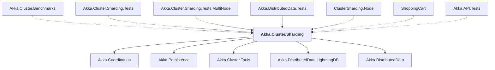

# Akka.Cluster.Sharding

## Overview

| Property | Value |
|----------|-------|
| Category | Library |
| Repository | akka.net |
| Path | `src/contrib/cluster/Akka.Cluster.Sharding/Akka.Cluster.Sharding.csproj` |
| Project References | 5 |
| NuGet Dependencies | 0 |
| Consumers | 7 |

## Dependency Diagram

## Project References
- Akka.Coordination
- Akka.Persistence
- Akka.Cluster.Tools
- Akka.DistributedData.LightningDB
- Akka.DistributedData

## Consumed By
- Akka.Cluster.Benchmarks
- Akka.Cluster.Sharding.Tests
- Akka.Cluster.Sharding.Tests.MultiNode
- Akka.DistributedData.Tests
- ClusterSharding.Node
- ShoppingCart
- Akka.API.Tests

---

*[Back to Index](../index.md)*
