# Akka.Cluster

## Overview

| Property | Value |
|----------|-------|
| Category | Library |
| Repository | akka.net |
| Path | `src/core/Akka.Cluster/Akka.Cluster.csproj` |
| Project References | 2 |
| NuGet Dependencies | 1 |
| Consumers | 15 |

## Dependency Diagram

```mermaid
graph TD
    Akka_Cluster["<strong>Akka.Cluster</strong>"]
    Akka_Coordination["Akka.Coordination"]
    Akka_Cluster --> Akka_Coordination
    Akka_Remote["Akka.Remote"]
    Akka_Cluster --> Akka_Remote
    Akka_Benchmarks["Akka.Benchmarks"]
    Akka_Benchmarks -.-> Akka_Cluster
    Akka_Cluster_Cpu_Benchmark["Akka.Cluster.Cpu.Benchmark"]
    Akka_Cluster_Cpu_Benchmark -.-> Akka_Cluster
    Akka_Cluster_Metrics["Akka.Cluster.Metrics"]
    Akka_Cluster_Metrics -.-> Akka_Cluster
    Akka_DistributedData["Akka.DistributedData"]
    Akka_DistributedData -.-> Akka_Cluster
    Akka_Cluster_Tools["Akka.Cluster.Tools"]
    Akka_Cluster_Tools -.-> Akka_Cluster
    Samples_Cluster_Transformation["Samples.Cluster.Transformation"]
    Samples_Cluster_Transformation -.-> Akka_Cluster
    Samples_Cluster_ConsistentHashRouting["Samples.Cluster.ConsistentHashRouting"]
    Samples_Cluster_ConsistentHashRouting -.-> Akka_Cluster
    Samples_Cluster_Simple["Samples.Cluster.Simple"]
    Samples_Cluster_Simple -.-> Akka_Cluster
    SampleDestination["SampleDestination"]
    SampleDestination -.-> Akka_Cluster
    SampleSubscriber["SampleSubscriber"]
    SampleSubscriber -.-> Akka_Cluster
    SampleSender["SampleSender"]
    SampleSender -.-> Akka_Cluster
    Akka_Cluster_TestKit["Akka.Cluster.TestKit"]
    Akka_Cluster_TestKit -.-> Akka_Cluster
    Akka_API_Tests["Akka.API.Tests"]
    Akka_API_Tests -.-> Akka_Cluster
    Akka_Cluster_Tests_Performance["Akka.Cluster.Tests.Performance"]
    Akka_Cluster_Tests_Performance -.-> Akka_Cluster
    Akka_Cluster_Tests["Akka.Cluster.Tests"]
    Akka_Cluster_Tests -.-> Akka_Cluster
```

## Project References
- Akka.Coordination
- Akka.Remote

## Consumed By
- Akka.Benchmarks
- Akka.Cluster.Cpu.Benchmark
- Akka.Cluster.Metrics
- Akka.DistributedData
- Akka.Cluster.Tools
- Samples.Cluster.Transformation
- Samples.Cluster.ConsistentHashRouting
- Samples.Cluster.Simple
- SampleDestination
- SampleSubscriber
- SampleSender
- Akka.Cluster.TestKit
- Akka.API.Tests
- Akka.Cluster.Tests.Performance
- Akka.Cluster.Tests

## External NuGet Packages
| Package | Version |
|---------|---------||
| Grpc.Tools | 2.60.0 |

---

*[Back to Index](../index.md)*
