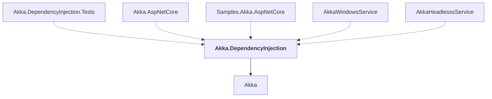

# Akka.DependencyInjection

## Overview

| Property | Value |
|----------|-------|
| Category | Library |
| Repository | akka.net |
| Path | `src/contrib/dependencyinjection/Akka.DependencyInjection/Akka.DependencyInjection.csproj` |
| Project References | 1 |
| NuGet Dependencies | 1 |
| Consumers | 5 |

## Dependency Diagram

## Project References
- Akka

## Consumed By
- Akka.DependencyInjection.Tests
- Akka.AspNetCore
- Samples.Akka.AspNetCore
- AkkaWindowsService
- AkkaHeadlesssService

## External NuGet Packages
| Package | Version |
|---------|---------||
| Microsoft.Extensions.DependencyInjection.Abstractions | [6.0.*,) |

---

*[Back to Index](../index.md)*
