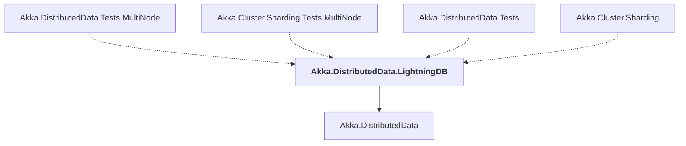

# Akka.DistributedData.LightningDB

## Overview

| Property | Value |
|----------|-------|
| Category | Library |
| Repository | akka.net |
| Path | `src/contrib/cluster/Akka.DistributedData.LightningDB/Akka.DistributedData.LightningDB.csproj` |
| Project References | 1 |
| NuGet Dependencies | 1 |
| Consumers | 4 |

## Dependency Diagram

## Project References
- Akka.DistributedData

## Consumed By
- Akka.DistributedData.Tests.MultiNode
- Akka.Cluster.Sharding.Tests.MultiNode
- Akka.DistributedData.Tests
- Akka.Cluster.Sharding

## External NuGet Packages
| Package | Version |
|---------|---------||
| LightningDB | 0.16.0 |

---

*[Back to Index](../index.md)*
