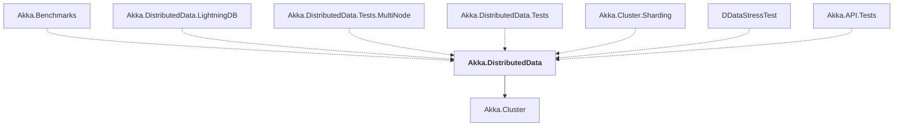

# Akka.DistributedData

## Overview

| Property | Value |
|----------|-------|
| Category | Library |
| Repository | akka.net |
| Path | `src/contrib/cluster/Akka.DistributedData/Akka.DistributedData.csproj` |
| Project References | 1 |
| NuGet Dependencies | 1 |
| Consumers | 7 |

## Dependency Diagram

## Project References
- Akka.Cluster

## Consumed By
- Akka.Benchmarks
- Akka.DistributedData.LightningDB
- Akka.DistributedData.Tests.MultiNode
- Akka.DistributedData.Tests
- Akka.Cluster.Sharding
- DDataStressTest
- Akka.API.Tests

## External NuGet Packages
| Package | Version |
|---------|---------||
| Grpc.Tools | 2.60.0 |

---

*[Back to Index](../index.md)*
