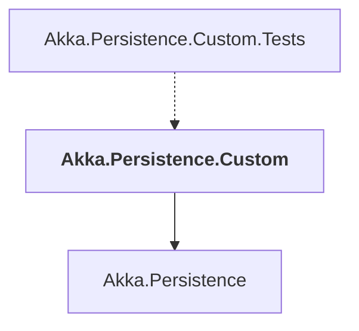

# Akka.Persistence.Custom

## Overview

| Property | Value |
|----------|-------|
| Category | Library |
| Repository | akka.net |
| Path | `src/examples/Akka.Persistence.Custom/Akka.Persistence.Custom.csproj` |
| Project References | 1 |
| NuGet Dependencies | 1 |
| Consumers | 1 |

## Dependency Diagram

## Project References
- Akka.Persistence

## Consumed By
- Akka.Persistence.Custom.Tests

## External NuGet Packages
| Package | Version |
|---------|---------||
| Microsoft.Data.SQLite | 8.0.4 |

---

*[Back to Index](../index.md)*
