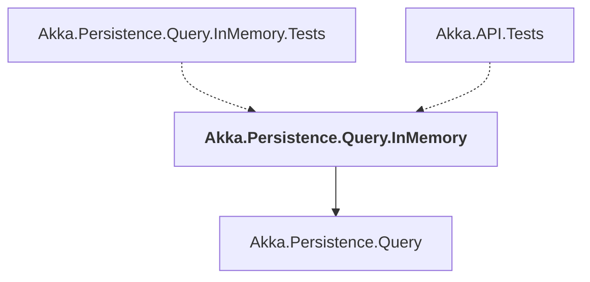

# Akka.Persistence.Query.InMemory

## Overview

| Property | Value |
|----------|-------|
| Category | Library |
| Repository | akka.net |
| Path | `src/contrib/persistence/Akka.Persistence.Query.InMemory/Akka.Persistence.Query.InMemory.csproj` |
| Project References | 1 |
| NuGet Dependencies | 0 |
| Consumers | 2 |

## Dependency Diagram

## Project References
- Akka.Persistence.Query

## Consumed By
- Akka.Persistence.Query.InMemory.Tests
- Akka.API.Tests

---

*[Back to Index](../index.md)*
