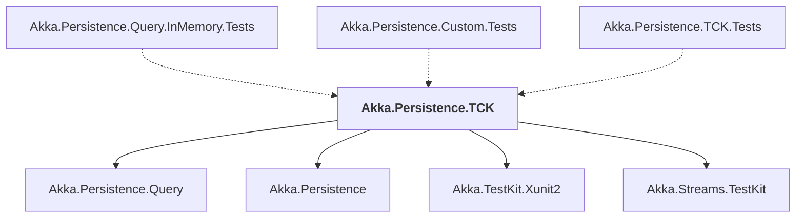

# Akka.Persistence.TCK

## Overview

| Property | Value |
|----------|-------|
| Category | Library |
| Repository | akka.net |
| Path | `src/core/Akka.Persistence.TCK/Akka.Persistence.TCK.csproj` |
| Project References | 4 |
| NuGet Dependencies | 2 |
| Consumers | 3 |

## Dependency Diagram

## Project References
- Akka.Persistence.Query
- Akka.Persistence
- Akka.TestKit.Xunit2
- Akka.Streams.TestKit

## Consumed By
- Akka.Persistence.Query.InMemory.Tests
- Akka.Persistence.Custom.Tests
- Akka.Persistence.TCK.Tests

## External NuGet Packages
| Package | Version |
|---------|---------||
| FluentAssertions | 5.10.3 |
| MathNet.Numerics | 5.0.0 |

---

*[Back to Index](../index.md)*
