# Akka.Persistence

## Overview

| Property | Value |
|----------|-------|
| Category | Library |
| Repository | akka.net |
| Path | `src/core/Akka.Persistence/Akka.Persistence.csproj` |
| Project References | 1 |
| NuGet Dependencies | 2 |
| Consumers | 12 |

## Dependency Diagram

```mermaid
graph TD
    Akka_Persistence["<strong>Akka.Persistence</strong>"]
    Akka["Akka"]
    Akka_Persistence --> Akka
    Akka_Benchmarks["Akka.Benchmarks"]
    Akka_Benchmarks -.-> Akka_Persistence
    Akka_Cluster_Sharding_Tests["Akka.Cluster.Sharding.Tests"]
    Akka_Cluster_Sharding_Tests -.-> Akka_Persistence
    Akka_Cluster_Sharding["Akka.Cluster.Sharding"]
    Akka_Cluster_Sharding -.-> Akka_Persistence
    Akka_Persistence_Custom["Akka.Persistence.Custom"]
    Akka_Persistence_Custom -.-> Akka_Persistence
    PersistenceExample["PersistenceExample"]
    PersistenceExample -.-> Akka_Persistence
    Akka_Persistence_Tests["Akka.Persistence.Tests"]
    Akka_Persistence_Tests -.-> Akka_Persistence
    Akka_Docs_Tests["Akka.Docs.Tests"]
    Akka_Docs_Tests -.-> Akka_Persistence
    Akka_API_Tests["Akka.API.Tests"]
    Akka_API_Tests -.-> Akka_Persistence
    Akka_Persistence_Query["Akka.Persistence.Query"]
    Akka_Persistence_Query -.-> Akka_Persistence
    Akka_Persistence_TCK["Akka.Persistence.TCK"]
    Akka_Persistence_TCK -.-> Akka_Persistence
    Akka_Persistence_TestKit["Akka.Persistence.TestKit"]
    Akka_Persistence_TestKit -.-> Akka_Persistence
    Akka_Docs_Tutorials["Akka.Docs.Tutorials"]
    Akka_Docs_Tutorials -.-> Akka_Persistence
```

## Project References
- Akka

## Consumed By
- Akka.Benchmarks
- Akka.Cluster.Sharding.Tests
- Akka.Cluster.Sharding
- Akka.Persistence.Custom
- PersistenceExample
- Akka.Persistence.Tests
- Akka.Docs.Tests
- Akka.API.Tests
- Akka.Persistence.Query
- Akka.Persistence.TCK
- Akka.Persistence.TestKit
- Akka.Docs.Tutorials

## External NuGet Packages
| Package | Version |
|---------|---------||
| Google.Protobuf | 3.26.1 |
| Grpc.Tools | 2.60.0 |

---

*[Back to Index](../index.md)*
