# Akka.Remote

## Overview

| Property | Value |
|----------|-------|
| Category | Library |
| Repository | akka.net |
| Path | `src/core/Akka.Remote/Akka.Remote.csproj` |
| Project References | 1 |
| NuGet Dependencies | 3 |
| Consumers | 17 |

## Dependency Diagram

```mermaid
graph TD
    Akka_Remote["<strong>Akka.Remote</strong>"]
    Akka["Akka"]
    Akka_Remote --> Akka
    Akka_Benchmarks["Akka.Benchmarks"]
    Akka_Benchmarks -.-> Akka_Remote
    RemotePingPong["RemotePingPong"]
    RemotePingPong -.-> Akka_Remote
    TimeClient["TimeClient"]
    TimeClient -.-> Akka_Remote
    TimeServer["TimeServer"]
    TimeServer -.-> Akka_Remote
    System1["System1"]
    System1 -.-> Akka_Remote
    System2["System2"]
    System2 -.-> Akka_Remote
    Samples_Cluster_ConsistentHashRouting["Samples.Cluster.ConsistentHashRouting"]
    Samples_Cluster_ConsistentHashRouting -.-> Akka_Remote
    SampleSubscriber["SampleSubscriber"]
    SampleSubscriber -.-> Akka_Remote
    ChatClient["ChatClient"]
    ChatClient -.-> Akka_Remote
    ChatServer["ChatServer"]
    ChatServer -.-> Akka_Remote
    Akka_Persistence_Tests["Akka.Persistence.Tests"]
    Akka_Persistence_Tests -.-> Akka_Remote
    Akka_Remote_TestKit["Akka.Remote.TestKit"]
    Akka_Remote_TestKit -.-> Akka_Remote
    Akka_Streams_Tests["Akka.Streams.Tests"]
    Akka_Streams_Tests -.-> Akka_Remote
    Akka_Remote_Tests_Performance["Akka.Remote.Tests.Performance"]
    Akka_Remote_Tests_Performance -.-> Akka_Remote
    Akka_Cluster["Akka.Cluster"]
    Akka_Cluster -.-> Akka_Remote
    more_consumers["... +2 more"]
    more_consumers -.-> Akka_Remote
```

## Project References
- Akka

## Consumed By
- Akka.Benchmarks
- RemotePingPong
- TimeClient
- TimeServer
- System1
- System2
- Samples.Cluster.ConsistentHashRouting
- SampleSubscriber
- ChatClient
- ChatServer
- Akka.Persistence.Tests
- Akka.Remote.TestKit
- Akka.Streams.Tests
- Akka.Remote.Tests.Performance
- Akka.Cluster
- Akka.API.Tests
- Akka.Remote.Tests

## External NuGet Packages
| Package | Version |
|---------|---------||
| DotNetty.Handlers | 0.7.6 |
| Google.Protobuf | 3.26.1 |
| Grpc.Tools | 2.60.0 |

---

*[Back to Index](../index.md)*
