# Akka.Serialization.Hyperion

## Overview

| Property | Value |
|----------|-------|
| Category | Library |
| Repository | akka.net |
| Path | `src/contrib/serializers/Akka.Serialization.Hyperion/Akka.Serialization.Hyperion.csproj` |
| Project References | 1 |
| NuGet Dependencies | 3 |
| Consumers | 9 |

## Dependency Diagram

```mermaid
graph TD
    Akka_Serialization_Hyperion["<strong>Akka.Serialization.Hyperion</strong>"]
    Akka["Akka"]
    Akka_Serialization_Hyperion --> Akka
    SerializationBenchmarks["SerializationBenchmarks"]
    SerializationBenchmarks -.-> Akka_Serialization_Hyperion
    Akka_Benchmarks["Akka.Benchmarks"]
    Akka_Benchmarks -.-> Akka_Serialization_Hyperion
    Akka_Cluster_Sharding_Tests_MultiNode["Akka.Cluster.Sharding.Tests.MultiNode"]
    Akka_Cluster_Sharding_Tests_MultiNode -.-> Akka_Serialization_Hyperion
    Akka_Serialization_Hyperion_Tests["Akka.Serialization.Hyperion.Tests"]
    Akka_Serialization_Hyperion_Tests -.-> Akka_Serialization_Hyperion
    ClusterSharding_Node["ClusterSharding.Node"]
    ClusterSharding_Node -.-> Akka_Serialization_Hyperion
    ClusterToolsExample_Seed["ClusterToolsExample.Seed"]
    ClusterToolsExample_Seed -.-> Akka_Serialization_Hyperion
    ClusterToolsExample_Node["ClusterToolsExample.Node"]
    ClusterToolsExample_Node -.-> Akka_Serialization_Hyperion
    Akka_Persistence_Tests["Akka.Persistence.Tests"]
    Akka_Persistence_Tests -.-> Akka_Serialization_Hyperion
    Akka_Remote_Tests["Akka.Remote.Tests"]
    Akka_Remote_Tests -.-> Akka_Serialization_Hyperion
```

## Project References
- Akka

## Consumed By
- SerializationBenchmarks
- Akka.Benchmarks
- Akka.Cluster.Sharding.Tests.MultiNode
- Akka.Serialization.Hyperion.Tests
- ClusterSharding.Node
- ClusterToolsExample.Seed
- ClusterToolsExample.Node
- Akka.Persistence.Tests
- Akka.Remote.Tests

## External NuGet Packages
| Package | Version |
|---------|---------||
| Hyperion | 0.12.2 |
| System.Reflection | 4.3.0 |
| System.Runtime | 4.3.1 |

---

*[Back to Index](../index.md)*
