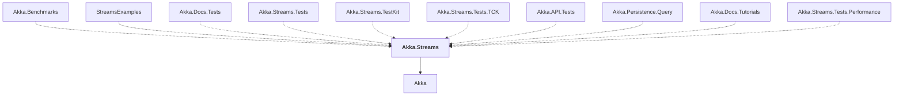

# Akka.Streams

## Overview

| Property | Value |
|----------|-------|
| Category | Library |
| Repository | akka.net |
| Path | `src/core/Akka.Streams/Akka.Streams.csproj` |
| Project References | 1 |
| NuGet Dependencies | 5 |
| Consumers | 10 |

## Dependency Diagram

## Project References
- Akka

## Consumed By
- Akka.Benchmarks
- StreamsExamples
- Akka.Docs.Tests
- Akka.Streams.Tests
- Akka.Streams.TestKit
- Akka.Streams.Tests.TCK
- Akka.API.Tests
- Akka.Persistence.Query
- Akka.Docs.Tutorials
- Akka.Streams.Tests.Performance

## External NuGet Packages
| Package | Version |
|---------|---------||
| System.Reflection.TypeExtensions | 4.7.0 |
| Microsoft.Bcl.AsyncInterfaces | [6.0.*,) |
| Google.Protobuf | 3.26.1 |
| Reactive.Streams | 1.0.4 |
| Grpc.Tools | 2.60.0 |

---

*[Back to Index](../index.md)*
