# Akka

## Overview

| Property | Value |
|----------|-------|
| Category | Library |
| Repository | akka.net |
| Path | `src/core/Akka/Akka.csproj` |
| Project References | 0 |
| NuGet Dependencies | 9 |
| Consumers | 41 |

## Dependency Diagram

```mermaid
graph TD
    Akka["<strong>Akka</strong>"]
    SerializationBenchmarks["SerializationBenchmarks"]
    SerializationBenchmarks -.-> Akka
    Akka_Benchmarks["Akka.Benchmarks"]
    Akka_Benchmarks -.-> Akka
    PingPong["PingPong"]
    PingPong -.-> Akka
    SpawnBenchmark["SpawnBenchmark"]
    SpawnBenchmark -.-> Akka
    Akka_DependencyInjection["Akka.DependencyInjection"]
    Akka_DependencyInjection -.-> Akka
    Akka_Serialization_Hyperion["Akka.Serialization.Hyperion"]
    Akka_Serialization_Hyperion -.-> Akka
    Akka_AspNetCore["Akka.AspNetCore"]
    Akka_AspNetCore -.-> Akka
    Samples_Akka_AspNetCore["Samples.Akka.AspNetCore"]
    Samples_Akka_AspNetCore -.-> Akka
    TimeClient["TimeClient"]
    TimeClient -.-> Akka
    TimeServer["TimeServer"]
    TimeServer -.-> Akka
    System1["System1"]
    System1 -.-> Akka
    System2["System2"]
    System2 -.-> Akka
    Shared["Shared"]
    Shared -.-> Akka
    Samples_Cluster_ConsistentHashRouting["Samples.Cluster.ConsistentHashRouting"]
    Samples_Cluster_ConsistentHashRouting -.-> Akka
    SampleDestination["SampleDestination"]
    SampleDestination -.-> Akka
    more_consumers["... +26 more"]
    more_consumers -.-> Akka
```

## Consumed By
- SerializationBenchmarks
- Akka.Benchmarks
- PingPong
- SpawnBenchmark
- Akka.DependencyInjection
- Akka.Serialization.Hyperion
- Akka.AspNetCore
- Samples.Akka.AspNetCore
- TimeClient
- TimeServer
- System1
- System2
- Shared
- Samples.Cluster.ConsistentHashRouting
- SampleDestination
- SamplePublisher
- SampleSubscriber
- SampleSender
- StreamsExamples
- TcpEchoService.Server
- HelloAkka
- Routing
- AkkaWindowsService
- HelloWorld
- AkkaHeadlesssService
- SymbolLookup
- ChatMessages
- FaultTolerance
- Akka.Tests.Performance
- Akka.Docs.Tests
- Akka.Discovery
- Akka.TestKit.Tests
- Akka.Streams.Tests.TCK
- Akka.API.Tests
- Akka.Persistence
- Akka.Streams
- Akka.Coordination
- Akka.Remote
- Akka.Tests
- Akka.TestKit
- Akka.Docs.Tutorials

## External NuGet Packages
| Package | Version |
|---------|---------||
| Microsoft.Extensions.ObjectPool | [6.0.*,) |
| Newtonsoft.Json | [13.0.1,) |
| System.Collections.Immutable | [6.0.*,) |
| System.Configuration.ConfigurationManager | 6.0.1 |
| Polyfill | 1.28.0 |
| System.Diagnostics.DiagnosticSource | [6.0.*,) |
| System.Reflection.Emit | 4.7.0 |
| System.Threading.Channels | [6.0.*,) |
| Akka.Analyzers | 0.3.3 |

---

*[Back to Index](../index.md)*
