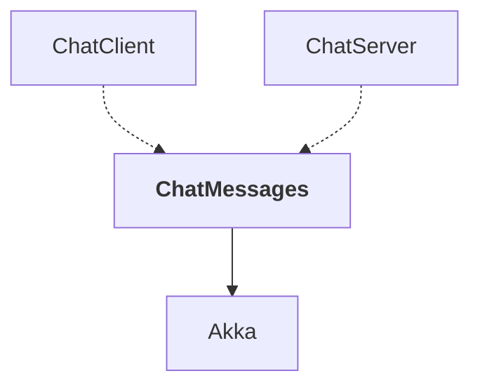

# ChatMessages

## Overview

| Property | Value |
|----------|-------|
| Category | Library |
| Repository | akka.net |
| Path | `src/examples/Chat/ChatMessages/ChatMessages.csproj` |
| Project References | 1 |
| NuGet Dependencies | 0 |
| Consumers | 2 |

## Dependency Diagram

## Project References
- Akka

## Consumed By
- ChatClient
- ChatServer

---

*[Back to Index](../index.md)*
