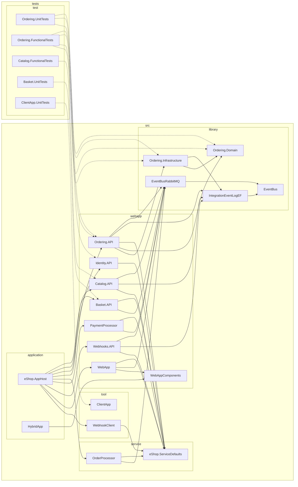
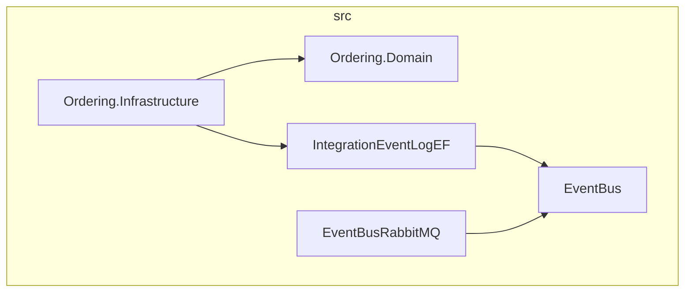
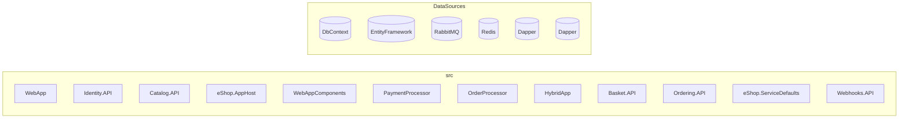
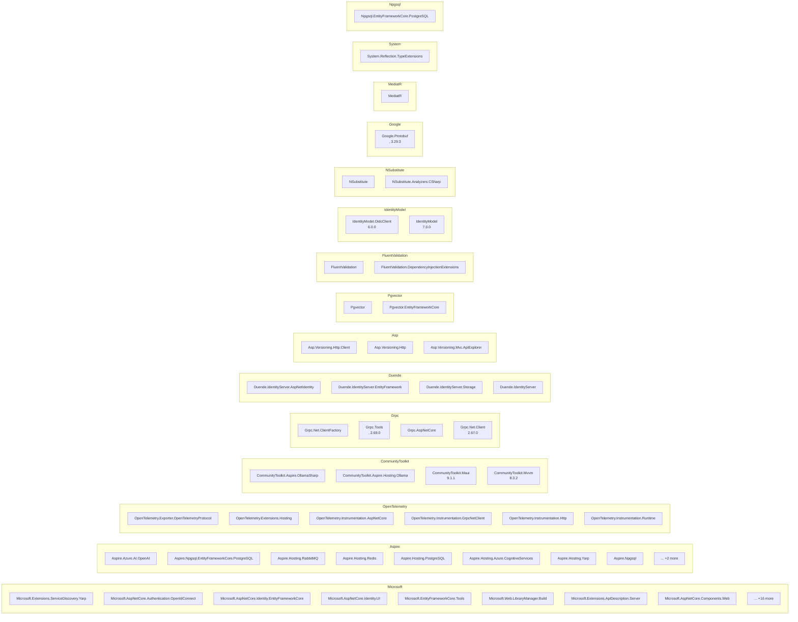

# Dependency Map

## Overview

| Metric | Count |
|--------|-------|
| Repositories | 2 |
| Total Projects | 24 |
| NuGet Packages | 69 |
| Project References | 46 |
| Cross-Repo References | 10 |
| Data Access Findings | 77 |
| Config Files | 31 |

## Repositories

| Repo | Projects | Categories |
|------|----------|------------|
| **src** | 19 | WebApp:8, Library:5, Application:2, Service:2, Tool:2 |
| **tests** | 5 | Test:5 |

## Project Categories

| Category | Count |
|----------|-------|
| WebApp | 8 |
| Library | 5 |
| Test | 5 |
| Application | 2 |
| Service | 2 |
| Tool | 2 |

## Full Landscape

## Core Library Hierarchy

## Data Infrastructure

## NuGet Package Groups

## Navigation

### src
**Application** (2): [eShop.AppHost](repos/src/eShop.AppHost.md), [HybridApp](repos/src/HybridApp.md)

**Library** (5): [Ordering.Domain](repos/src/Ordering.Domain.md), [Ordering.Infrastructure](repos/src/Ordering.Infrastructure.md), [IntegrationEventLogEF](repos/src/IntegrationEventLogEF.md), [EventBus](repos/src/EventBus.md), [EventBusRabbitMQ](repos/src/EventBusRabbitMQ.md)

**Service** (2): [OrderProcessor](repos/src/OrderProcessor.md), [eShop.ServiceDefaults](repos/src/eShop.ServiceDefaults.md)

**Tool** (2): [ClientApp](repos/src/ClientApp.md), [WebhookClient](repos/src/WebhookClient.md)

**WebApp** (8): [WebApp](repos/src/WebApp.md), [Identity.API](repos/src/Identity.API.md), [Catalog.API](repos/src/Catalog.API.md), [WebAppComponents](repos/src/WebAppComponents.md), [PaymentProcessor](repos/src/PaymentProcessor.md), [Basket.API](repos/src/Basket.API.md), [Ordering.API](repos/src/Ordering.API.md), [Webhooks.API](repos/src/Webhooks.API.md)

### tests
**Test** (5): [Ordering.UnitTests](repos/tests/Ordering.UnitTests.md), [Ordering.FunctionalTests](repos/tests/Ordering.FunctionalTests.md), [Catalog.FunctionalTests](repos/tests/Catalog.FunctionalTests.md), [Basket.UnitTests](repos/tests/Basket.UnitTests.md), [ClientApp.UnitTests](repos/tests/ClientApp.UnitTests.md)

- [Data Source Registry](data-sources/registry.md)

---

*Generated: 2026-02-10*
*Tool: Dependency Mapper (Static Analysis)*
