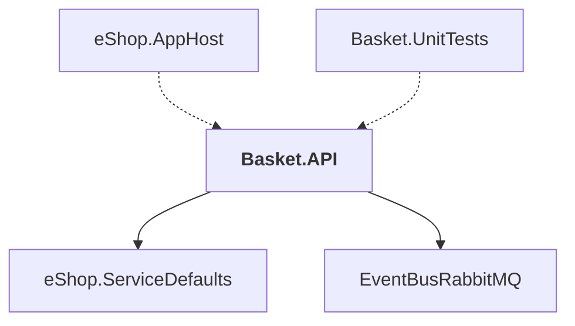

# Basket.API

## Overview

| Property | Value |
|----------|-------|
| Category | WebApp |
| Repository | src |
| Path | `Basket.API/Basket.API.csproj` |
| Project References | 2 |
| NuGet Dependencies | 2 |
| Consumers | 2 |

## Dependency Diagram

## Project References
- eShop.ServiceDefaults
- EventBusRabbitMQ

## Consumed By
- eShop.AppHost
- Basket.UnitTests

## External NuGet Packages
| Package | Version |
|---------|---------||
| Aspire.StackExchange.Redis |  |
| Grpc.AspNetCore |  |

## Data Access Patterns
### gRPC
| File | Line | Context |
|------|------|---------||
| `src/Basket.API/GlobalUsings.cs` | 4 | `global using Grpc.Core;` |

### Redis
| File | Line | Context |
|------|------|---------||
| `src/Basket.API/GlobalUsings.cs` | 11 | `global using StackExchange.Redis;` |
| `src/Basket.API/Repositories/RedisBasketRepository.cs` | 6 | `public class RedisBasketRepository(ILogger<RedisBasketRepository> logg` |

### Repository
| File | Line | Context |
|------|------|---------||
| `src/Basket.API/Repositories/RedisBasketRepository.cs` | 6 | `public class RedisBasketRepository(ILogger<RedisBasketRepository> logg` |

---

*[Back to Index](../../index.md)*
