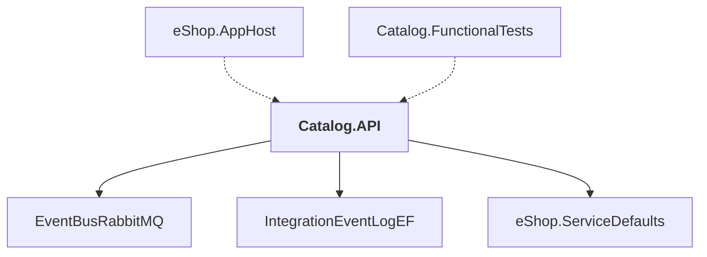

# Catalog.API

## Overview

| Property | Value |
|----------|-------|
| Category | WebApp |
| Repository | src |
| Path | `Catalog.API/Catalog.API.csproj` |
| Project References | 3 |
| NuGet Dependencies | 8 |
| Consumers | 2 |

## Dependency Diagram

## Project References
- EventBusRabbitMQ
- IntegrationEventLogEF
- eShop.ServiceDefaults

## Consumed By
- eShop.AppHost
- Catalog.FunctionalTests

## External NuGet Packages
| Package | Version |
|---------|---------||
| Asp.Versioning.Http |  |
| Aspire.Npgsql.EntityFrameworkCore.PostgreSQL |  |
| CommunityToolkit.Aspire.OllamaSharp |  |
| Microsoft.EntityFrameworkCore.Tools |  |
| Microsoft.Extensions.ApiDescription.Server |  |
| Aspire.Azure.AI.OpenAI |  |
| Pgvector |  |
| Pgvector.EntityFrameworkCore |  |

## Data Access Patterns
### MongoDB.Read
| File | Line | Context |
|------|------|---------||
| `src/Catalog.API/IntegrationEvents/EventHandling/OrderStatusChangedToAwaitingValidationIntegrationEventHandler.cs` | 17 | `var catalogItem = catalogContext.CatalogItems.Find(orderStockItem.Prod` |
| `src/Catalog.API/IntegrationEvents/EventHandling/OrderStatusChangedToPaidIntegrationEventHandler.cs` | 15 | `var catalogItem = catalogContext.CatalogItems.Find(orderStockItem.Prod` |
| `src/Catalog.API/Apis/CatalogApi.cs` | 210 | `var item = await context.CatalogItems.FindAsync(id);` |

### Dapper.Execute
| File | Line | Context |
|------|------|---------||
| `src/Catalog.API/IntegrationEvents/CatalogIntegrationEventService.cs` | 34 | `await ResilientTransaction.New(catalogContext).ExecuteAsync(async () =` |

### DbContext
| File | Line | Context |
|------|------|---------||
| `src/Catalog.API/Infrastructure/CatalogContext.cs` | 8 | `public class CatalogContext : DbContext` |

### DbSet
| File | Line | Context |
|------|------|---------||
| `src/Catalog.API/Infrastructure/CatalogContext.cs` | 14 | `public required DbSet<CatalogItem> CatalogItems { get; set; }` |
| `src/Catalog.API/Infrastructure/CatalogContext.cs` | 15 | `public required DbSet<CatalogBrand> CatalogBrands { get; set; }` |
| `src/Catalog.API/Infrastructure/CatalogContext.cs` | 16 | `public required DbSet<CatalogType> CatalogTypes { get; set; }` |

### File.Read
| File | Line | Context |
|------|------|---------||
| `src/Catalog.API/Infrastructure/CatalogContextSeed.cs` | 26 | `var sourceJson = File.ReadAllText(sourcePath);` |

### EntityFramework
| File | Line | Context |
|------|------|---------||
| `src/Catalog.API/Extensions/Extensions.cs` | 17 | `dbContextOptionsBuilder.UseNpgsql(builder =>` |

### ConnectionString
| File | Line | Context |
|------|------|---------||
| `src/Catalog.API/Extensions/Extensions.cs` | 43 | `else if (!string.IsNullOrWhiteSpace(builder.Configuration.GetConnectio` |

### API.MapGet
| File | Line | Context |
|------|------|---------||
| `src/Catalog.API/Apis/CatalogApi.cs` | 21 | `v1.MapGet("/items", GetAllItemsV1)` |
| `src/Catalog.API/Apis/CatalogApi.cs` | 26 | `v2.MapGet("/items", GetAllItems)` |
| `src/Catalog.API/Apis/CatalogApi.cs` | 31 | `api.MapGet("/items/by", GetItemsByIds)` |
| `src/Catalog.API/Apis/CatalogApi.cs` | 36 | `api.MapGet("/items/{id:int}", GetItemById)` |
| `src/Catalog.API/Apis/CatalogApi.cs` | 41 | `v1.MapGet("/items/by/{name:minlength(1)}", GetItemsByName)` |
| `src/Catalog.API/Apis/CatalogApi.cs` | 46 | `api.MapGet("/items/{id:int}/pic", GetItemPictureById)` |
| `src/Catalog.API/Apis/CatalogApi.cs` | 53 | `v1.MapGet("/items/withsemanticrelevance/{text:minlength(1)}", GetItems` |
| `src/Catalog.API/Apis/CatalogApi.cs` | 60 | `v2.MapGet("/items/withsemanticrelevance", GetItemsBySemanticRelevance)` |
| `src/Catalog.API/Apis/CatalogApi.cs` | 67 | `v1.MapGet("/items/type/{typeId}/brand/{brandId?}", GetItemsByBrandAndT` |
| `src/Catalog.API/Apis/CatalogApi.cs` | 72 | `v1.MapGet("/items/type/all/brand/{brandId:int?}", GetItemsByBrandId)` |
| `src/Catalog.API/Apis/CatalogApi.cs` | 77 | `api.MapGet("/catalogtypes",` |
| `src/Catalog.API/Apis/CatalogApi.cs` | 84 | `api.MapGet("/catalogbrands",` |

### API.MapPost
| File | Line | Context |
|------|------|---------||
| `src/Catalog.API/Apis/CatalogApi.cs` | 103 | `api.MapPost("/items", CreateItem)` |

### API.MapPut
| File | Line | Context |
|------|------|---------||
| `src/Catalog.API/Apis/CatalogApi.cs` | 93 | `v1.MapPut("/items", UpdateItemV1)` |
| `src/Catalog.API/Apis/CatalogApi.cs` | 98 | `v2.MapPut("/items/{id:int}", UpdateItem)` |

### API.MapDelete
| File | Line | Context |
|------|------|---------||
| `src/Catalog.API/Apis/CatalogApi.cs` | 107 | `api.MapDelete("/items/{id:int}", DeleteItemById)` |

### API.MapGroup
| File | Line | Context |
|------|------|---------||
| `src/Catalog.API/Apis/CatalogApi.cs` | 16 | `var api = vApi.MapGroup("api/catalog").HasApiVersion(1, 0).HasApiVersi` |
| `src/Catalog.API/Apis/CatalogApi.cs` | 17 | `var v1 = vApi.MapGroup("api/catalog").HasApiVersion(1, 0);` |
| `src/Catalog.API/Apis/CatalogApi.cs` | 18 | `var v2 = vApi.MapGroup("api/catalog").HasApiVersion(2, 0);` |

---

*[Back to Index](../../index.md)*
