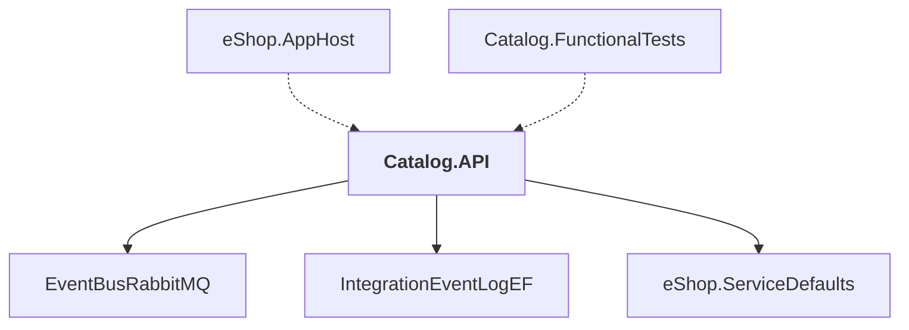

# Catalog.API

## Overview

| Property | Value |
|----------|-------|
| Category | WebApp |
| Repository | src |
| Path | `Catalog.API/Catalog.API.csproj` |
| Project References | 3 |
| NuGet Dependencies | 8 |
| Consumers | 2 |

## Dependency Diagram

## Project References
- EventBusRabbitMQ
- IntegrationEventLogEF
- eShop.ServiceDefaults

## Consumed By
- eShop.AppHost
- Catalog.FunctionalTests

## External NuGet Packages
| Package | Version |
|---------|---------||
| Asp.Versioning.Http |  |
| Aspire.Npgsql.EntityFrameworkCore.PostgreSQL |  |
| CommunityToolkit.Aspire.OllamaSharp |  |
| Microsoft.EntityFrameworkCore.Tools |  |
| Microsoft.Extensions.ApiDescription.Server |  |
| Aspire.Azure.AI.OpenAI |  |
| Pgvector |  |
| Pgvector.EntityFrameworkCore |  |

## Data Access Patterns
### DbContext
| File | Line | Context |
|------|------|---------||
| `src/Catalog.API/Infrastructure/CatalogContext.cs` | 8 | `public class CatalogContext : DbContext` |

### ConnectionString
| File | Line | Context |
|------|------|---------||
| `src/Catalog.API/Extensions/Extensions.cs` | 43 | `else if (!string.IsNullOrWhiteSpace(builder.Configuration.GetConnectio` |

### EntityFramework
| File | Line | Context |
|------|------|---------||
| `src/Catalog.API/Extensions/Extensions.cs` | 17 | `dbContextOptionsBuilder.UseNpgsql(builder =>` |

---

*[Back to Index](../../index.md)*
