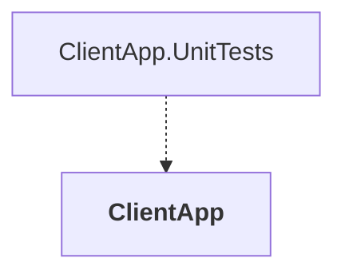

# ClientApp

## Overview

| Property | Value |
|----------|-------|
| Category | Tool |
| Repository | src |
| Path | `ClientApp/ClientApp.csproj` |
| Project References | 0 |
| NuGet Dependencies | 11 |
| Consumers | 1 |

## Dependency Diagram

## Consumed By
- ClientApp.UnitTests

## External NuGet Packages
| Package | Version |
|---------|---------||
| Google.Protobuf | 3.29.3 |
| Grpc.Net.Client | 2.67.0 |
| Grpc.Tools | 2.69.0 |
| IdentityModel.OidcClient | 6.0.0 |
| Microsoft.Maui.Controls | 9.0.30 |
| Microsoft.Maui.Controls.Compatibility | 9.0.30 |
| Microsoft.Maui.Controls.Maps | 9.0.30 |
| Microsoft.Extensions.Logging.Debug | 9.0.0 |
| CommunityToolkit.Maui | 9.1.1 |
| IdentityModel | 7.0.0 |
| CommunityToolkit.Mvvm | 8.3.2 |

## Data Access Patterns
### Dapper.Execute
| File | Line | Context |
|------|------|---------||
| `src/ClientApp/Views/ContentPageBase.cs` | 21 | `await ivmb.InitializeAsyncCommand.ExecuteAsync(null);` |
| `src/ClientApp/Views/ProfileView.xaml.cs` | 20 | `_viewModel.RefreshCommand.Execute(null);` |
| `src/ClientApp/Controls/ToggleButton.cs` | 77 | `Command.Execute(CommandParameter);` |

### HttpClient.New
| File | Line | Context |
|------|------|---------||
| `src/ClientApp/Services/RequestProvider/RequestProvider.cs` | 15 | `var httpClient = _messageHandler is not null ? new HttpClient(_message` |

### Redis.Read
| File | Line | Context |
|------|------|---------||
| `src/ClientApp/Services/RequestProvider/RequestProvider.cs` | 24 | `using var response = await httpClient.GetAsync(uri).ConfigureAwait(fal` |
| `src/ClientApp/Services/Settings/SettingsService.cs` | 44 | `var userToken = await SecureStorage.GetAsync(UserAccessToken).Configur` |
| `src/ClientApp/Services/Settings/SettingsService.cs` | 51 | `get => Preferences.Get(IdUseMocks, UseMocksDefault);` |
| `src/ClientApp/Services/Settings/SettingsService.cs` | 57 | `get => Preferences.Get(nameof(DefaultEndpoint), string.Empty);` |
| `src/ClientApp/Services/Settings/SettingsService.cs` | 63 | `get => Preferences.Get(nameof(RegistrationEndpoint), string.Empty);` |
| `src/ClientApp/Services/Settings/SettingsService.cs` | 69 | `get => Preferences.Get(nameof(AuthorizeEndpoint), string.Empty);` |
| `src/ClientApp/Services/Settings/SettingsService.cs` | 75 | `get => Preferences.Get(nameof(UserInfoEndpoint), string.Empty);` |
| `src/ClientApp/Services/Settings/SettingsService.cs` | 81 | `get => Preferences.Get(nameof(ClientId), DefaultClientId);` |
| `src/ClientApp/Services/Settings/SettingsService.cs` | 87 | `get => Preferences.Get(nameof(ClientSecret), DefaultClientSecret);` |
| `src/ClientApp/Services/Settings/SettingsService.cs` | 93 | `get => Preferences.Get(nameof(CallbackUri), DefaultCallbackUri);` |
| `src/ClientApp/Services/Settings/SettingsService.cs` | 99 | `get => Preferences.Get(IdIdentityBase, string.Empty);` |
| `src/ClientApp/Services/Settings/SettingsService.cs` | 105 | `get => Preferences.Get(IdGatewayShoppingBase, string.Empty);` |
| `src/ClientApp/Services/Settings/SettingsService.cs` | 111 | `get => Preferences.Get(IdGatewayMarketingBase, string.Empty);` |
| `src/ClientApp/Services/Settings/SettingsService.cs` | 117 | `get => Preferences.Get(IdGatewayOrdersBase, string.Empty);` |
| `src/ClientApp/Services/Settings/SettingsService.cs` | 123 | `get => Preferences.Get(IdGatewayBasketBase, string.Empty);` |

*... and 4 more*

### gRPC
| File | Line | Context |
|------|------|---------||
| `src/ClientApp/Services/Basket/Protos/Basket.cs` | 8 | `using pb = global::Google.Protobuf;` |
| `src/ClientApp/Services/Basket/Protos/Basket.cs` | 9 | `using pbc = global::Google.Protobuf.Collections;` |
| `src/ClientApp/Services/Basket/Protos/Basket.cs` | 10 | `using pbr = global::Google.Protobuf.Reflection;` |
| `src/ClientApp/Services/Basket/Protos/BasketGrpc.cs` | 8 | `using grpc = global::Grpc.Core;` |
| `src/ClientApp/Services/Basket/Protos/BasketGrpc.cs` | 16 | `static void __Helper_SerializeMessage(global::Google.Protobuf.IMessage` |
| `src/ClientApp/Services/Basket/Protos/BasketGrpc.cs` | 19 | `if (message is global::Google.Protobuf.IBufferMessage)` |
| `src/ClientApp/Services/Basket/Protos/BasketGrpc.cs` | 22 | `global::Google.Protobuf.MessageExtensions.WriteTo(message, context.Get` |
| `src/ClientApp/Services/Basket/Protos/BasketGrpc.cs` | 27 | `context.Complete(global::Google.Protobuf.MessageExtensions.ToByteArray` |
| `src/ClientApp/Services/Basket/Protos/BasketGrpc.cs` | 33 | `public static readonly bool IsBufferMessage = global::System.Reflectio` |
| `src/ClientApp/Services/Basket/Protos/BasketGrpc.cs` | 37 | `static T __Helper_DeserializeMessage<T>(grpc::DeserializationContext c` |
| `src/ClientApp/Services/Basket/Protos/BasketGrpc.cs` | 84 | `public static global::Google.Protobuf.Reflection.ServiceDescriptor Des` |
| `src/ClientApp/Services/Basket/BasketService.cs` | 6 | `using Google.Protobuf;` |
| `src/ClientApp/Services/Basket/BasketService.cs` | 7 | `using Grpc.Core;` |
| `src/ClientApp/Services/Basket/BasketService.cs` | 8 | `using Grpc.Net.Client;` |

### gRPC.Client
| File | Line | Context |
|------|------|---------||
| `src/ClientApp/Services/Basket/BasketService.cs` | 125 | `_channel = GrpcChannel.ForAddress(_settingsService.GatewayBasketEndpoi` |

### Redis.Write
| File | Line | Context |
|------|------|---------||
| `src/ClientApp/Services/Settings/SettingsService.cs` | 38 | `.SetAsync(UserAccessToken, userToken is not null ? JsonSerializer.Seri` |
| `src/ClientApp/Services/Settings/SettingsService.cs` | 52 | `set => Preferences.Set(IdUseMocks, value);` |
| `src/ClientApp/Services/Settings/SettingsService.cs` | 58 | `set => Preferences.Set(nameof(DefaultEndpoint), value);` |
| `src/ClientApp/Services/Settings/SettingsService.cs` | 64 | `set => Preferences.Set(nameof(RegistrationEndpoint), value);` |
| `src/ClientApp/Services/Settings/SettingsService.cs` | 70 | `set => Preferences.Set(nameof(AuthorizeEndpoint), value);` |
| `src/ClientApp/Services/Settings/SettingsService.cs` | 76 | `set => Preferences.Set(nameof(UserInfoEndpoint), value);` |
| `src/ClientApp/Services/Settings/SettingsService.cs` | 82 | `set => Preferences.Set(nameof(ClientId), value);` |
| `src/ClientApp/Services/Settings/SettingsService.cs` | 88 | `set => Preferences.Set(nameof(ClientSecret), value);` |
| `src/ClientApp/Services/Settings/SettingsService.cs` | 94 | `set => Preferences.Set(nameof(CallbackUri), value);` |
| `src/ClientApp/Services/Settings/SettingsService.cs` | 100 | `set => Preferences.Set(IdIdentityBase, value);` |
| `src/ClientApp/Services/Settings/SettingsService.cs` | 106 | `set => Preferences.Set(IdGatewayShoppingBase, value);` |
| `src/ClientApp/Services/Settings/SettingsService.cs` | 112 | `set => Preferences.Set(IdGatewayMarketingBase, value);` |
| `src/ClientApp/Services/Settings/SettingsService.cs` | 118 | `set => Preferences.Set(IdGatewayOrdersBase, value);` |
| `src/ClientApp/Services/Settings/SettingsService.cs` | 124 | `set => Preferences.Set(IdGatewayBasketBase, value);` |
| `src/ClientApp/Services/Settings/SettingsService.cs` | 130 | `set => Preferences.Set(IdUseFakeLocation, value);` |

*... and 3 more*

---

*[Back to Index](../../index.md)*
