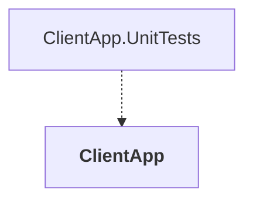

# ClientApp

## Overview

| Property | Value |
|----------|-------|
| Category | Tool |
| Repository | src |
| Path | `ClientApp/ClientApp.csproj` |
| Project References | 0 |
| NuGet Dependencies | 11 |
| Consumers | 1 |

## Dependency Diagram

## Consumed By
- ClientApp.UnitTests

## External NuGet Packages
| Package | Version |
|---------|---------||
| Google.Protobuf | 3.29.3 |
| Grpc.Net.Client | 2.67.0 |
| Grpc.Tools | 2.69.0 |
| IdentityModel.OidcClient | 6.0.0 |
| Microsoft.Maui.Controls | 9.0.30 |
| Microsoft.Maui.Controls.Compatibility | 9.0.30 |
| Microsoft.Maui.Controls.Maps | 9.0.30 |
| Microsoft.Extensions.Logging.Debug | 9.0.0 |
| CommunityToolkit.Maui | 9.1.1 |
| IdentityModel | 7.0.0 |
| CommunityToolkit.Mvvm | 8.3.2 |

## Data Access Patterns
### Dapper
| File | Line | Context |
|------|------|---------||
| `src/ClientApp/Views/ProfileView.xaml.cs` | 20 | `_viewModel.RefreshCommand.Execute(null);` |
| `src/ClientApp/Controls/ToggleButton.cs` | 77 | `Command.Execute(CommandParameter);` |

### HttpClient.New
| File | Line | Context |
|------|------|---------||
| `src/ClientApp/Services/RequestProvider/RequestProvider.cs` | 15 | `var httpClient = _messageHandler is not null ? new HttpClient(_message` |

### gRPC
| File | Line | Context |
|------|------|---------||
| `src/ClientApp/Services/Basket/Protos/BasketGrpc.cs` | 8 | `using grpc = global::Grpc.Core;` |
| `src/ClientApp/Services/Basket/BasketService.cs` | 7 | `using Grpc.Core;` |
| `src/ClientApp/Services/Basket/BasketService.cs` | 8 | `using Grpc.Net.Client;` |

---

*[Back to Index](../../index.md)*
