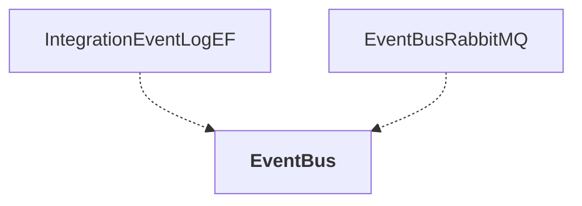

# EventBus

## Overview

| Property | Value |
|----------|-------|
| Category | Library |
| Repository | src |
| Path | `EventBus/EventBus.csproj` |
| Project References | 0 |
| NuGet Dependencies | 1 |
| Consumers | 2 |

## Dependency Diagram

## Consumed By
- IntegrationEventLogEF
- EventBusRabbitMQ

## External NuGet Packages
| Package | Version |
|---------|---------||
| Microsoft.Extensions.Options |  |

---

*[Back to Index](../../index.md)*
