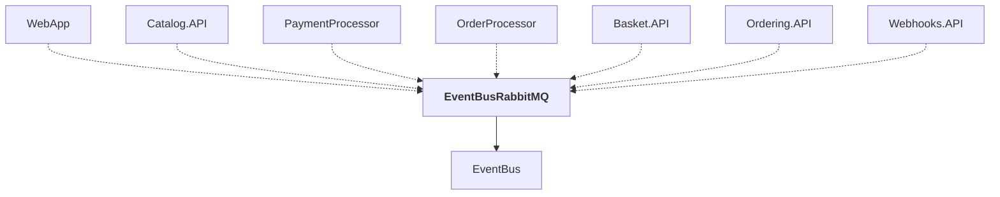

# EventBusRabbitMQ

## Overview

| Property | Value |
|----------|-------|
| Category | Library |
| Repository | src |
| Path | `EventBusRabbitMQ/EventBusRabbitMQ.csproj` |
| Project References | 1 |
| NuGet Dependencies | 1 |
| Consumers | 7 |

## Dependency Diagram

## Project References
- EventBus

## Consumed By
- WebApp
- Catalog.API
- PaymentProcessor
- OrderProcessor
- Basket.API
- Ordering.API
- Webhooks.API

## External NuGet Packages
| Package | Version |
|---------|---------||
| Aspire.RabbitMQ.Client |  |

## Data Access Patterns
### RabbitMQ
| File | Line | Context |
|------|------|---------||
| `src/EventBusRabbitMQ/GlobalUsings.cs` | 8 | `global using RabbitMQ.Client;` |
| `src/EventBusRabbitMQ/GlobalUsings.cs` | 9 | `global using RabbitMQ.Client.Events;` |
| `src/EventBusRabbitMQ/GlobalUsings.cs` | 10 | `global using RabbitMQ.Client.Exceptions;` |
| `src/EventBusRabbitMQ/RabbitMqDependencyInjectionExtensions.cs` | 23 | `// RabbitMQ.Client doesn't have built-in support for OpenTelemetry, so` |

### Dapper.Execute
| File | Line | Context |
|------|------|---------||
| `src/EventBusRabbitMQ/RabbitMQEventBus.cs` | 57 | `await _pipeline.Execute(async () =>` |

---

*[Back to Index](../../index.md)*
