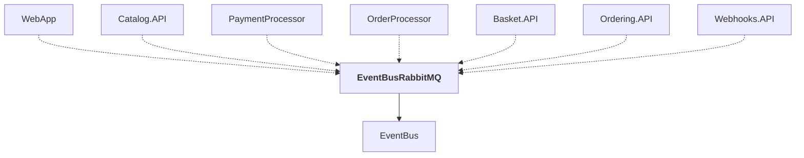

# EventBusRabbitMQ

## Overview

| Property | Value |
|----------|-------|
| Category | Library |
| Repository | src |
| Path | `EventBusRabbitMQ/EventBusRabbitMQ.csproj` |
| Project References | 1 |
| NuGet Dependencies | 1 |
| Consumers | 7 |

## Dependency Diagram

## Project References
- EventBus

## Consumed By
- WebApp
- Catalog.API
- PaymentProcessor
- OrderProcessor
- Basket.API
- Ordering.API
- Webhooks.API

## External NuGet Packages
| Package | Version |
|---------|---------||
| Aspire.RabbitMQ.Client |  |

## Data Access Patterns
### RabbitMQ
| File | Line | Context |
|------|------|---------||
| `src/EventBusRabbitMQ/GlobalUsings.cs` | 8 | `global using RabbitMQ.Client;` |
| `src/EventBusRabbitMQ/GlobalUsings.cs` | 9 | `global using RabbitMQ.Client.Events;` |
| `src/EventBusRabbitMQ/GlobalUsings.cs` | 10 | `global using RabbitMQ.Client.Exceptions;` |
| `src/EventBusRabbitMQ/EventBusOptions.cs` | 1 | `namespace eShop.EventBusRabbitMQ;` |
| `src/EventBusRabbitMQ/RabbitMQEventBus.cs` | 1 | `namespace eShop.EventBusRabbitMQ;` |
| `src/EventBusRabbitMQ/RabbitMQEventBus.cs` | 13 | `public sealed class RabbitMQEventBus(` |
| `src/EventBusRabbitMQ/RabbitMQEventBus.cs` | 14 | `ILogger<RabbitMQEventBus> logger,` |
| `src/EventBusRabbitMQ/RabbitMQEventBus.cs` | 18 | `RabbitMQTelemetry rabbitMQTelemetry) : IEventBus, IDisposable, IHosted` |
| `src/EventBusRabbitMQ/RabbitMQEventBus.cs` | 37 | `logger.LogTrace("Creating RabbitMQ channel to publish event: {EventId}` |
| `src/EventBusRabbitMQ/RabbitMQEventBus.cs` | 40 | `using var channel = (await _rabbitMQConnection?.CreateChannelAsync()) ` |
| `src/EventBusRabbitMQ/RabbitMQEventBus.cs` | 44 | `logger.LogTrace("Declaring RabbitMQ exchange to publish event: {EventI` |
| `src/EventBusRabbitMQ/RabbitMQEventBus.cs` | 92 | `logger.LogTrace("Publishing event to RabbitMQ: {EventId}", @event.Id);` |
| `src/EventBusRabbitMQ/RabbitMQEventBus.cs` | 187 | `logger.LogTrace("Processing RabbitMQ event: {EventName}", eventName);` |
| `src/EventBusRabbitMQ/RabbitMQEventBus.cs` | 233 | `logger.LogInformation("Starting RabbitMQ connection on a background th` |
| `src/EventBusRabbitMQ/RabbitMQEventBus.cs` | 243 | `logger.LogTrace("Creating RabbitMQ consumer channel");` |

*... and 13 more*

### Dapper
| File | Line | Context |
|------|------|---------||
| `src/EventBusRabbitMQ/RabbitMQEventBus.cs` | 57 | `await _pipeline.Execute(async () =>` |

---

*[Back to Index](../../index.md)*
