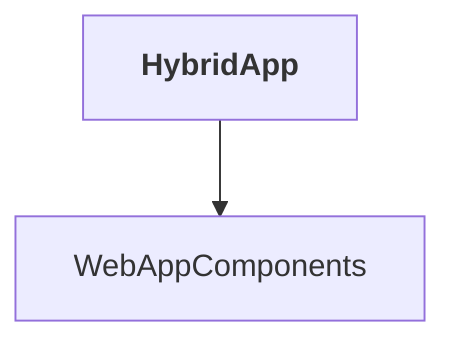

# HybridApp

## Overview

| Property | Value |
|----------|-------|
| Category | Application |
| Repository | src |
| Path | `HybridApp/HybridApp.csproj` |
| Project References | 1 |
| NuGet Dependencies | 5 |
| Consumers | 0 |

## Dependency Diagram

## Project References
- WebAppComponents

## External NuGet Packages
| Package | Version |
|---------|---------||
| Microsoft.AspNetCore.Components.WebView.Maui | 9.0.30 |
| Microsoft.Maui.Controls | 9.0.30 |
| Microsoft.Maui.Controls.Compatibility | 9.0.30 |
| Microsoft.Extensions.Http | 9.0.0 |
| Microsoft.Extensions.Logging.Debug | 9.0.0 |

## Data Access Patterns
### HttpClient.Injection
| File | Line | Context |
|------|------|---------||
| `src/HybridApp/MauiProgram.cs` | 30 | `builder.Services.AddHttpClient<CatalogService>(o => o.BaseAddress = ne` |

---

*[Back to Index](../../index.md)*
